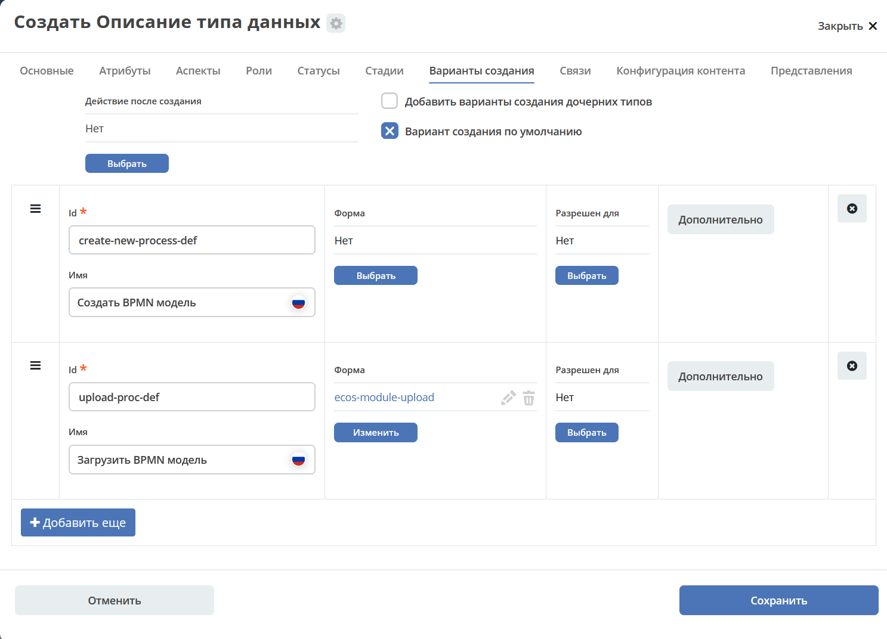
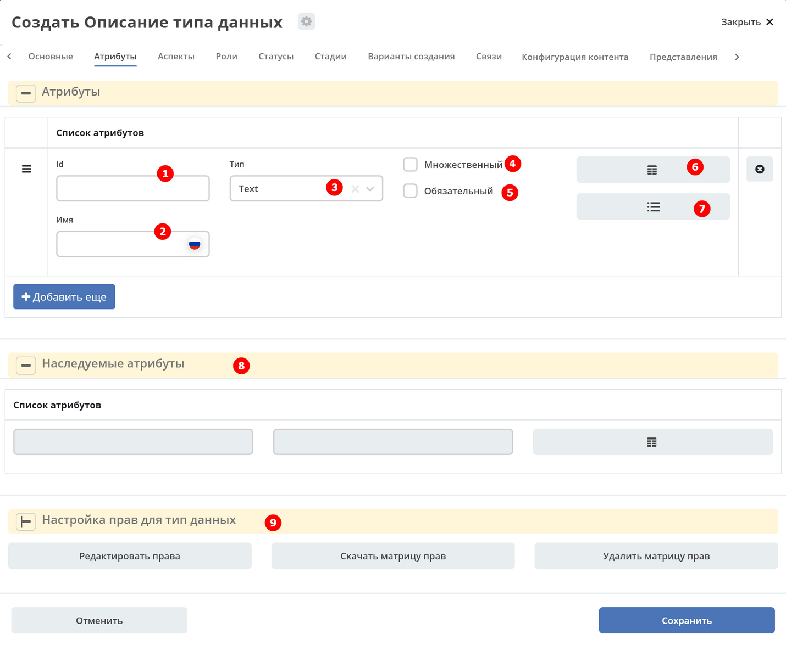
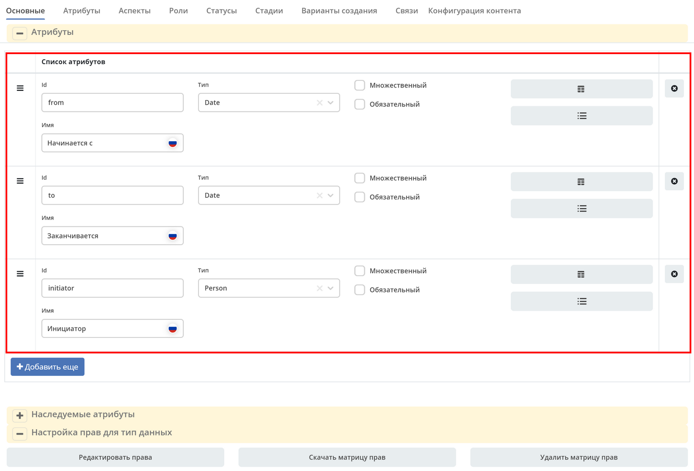
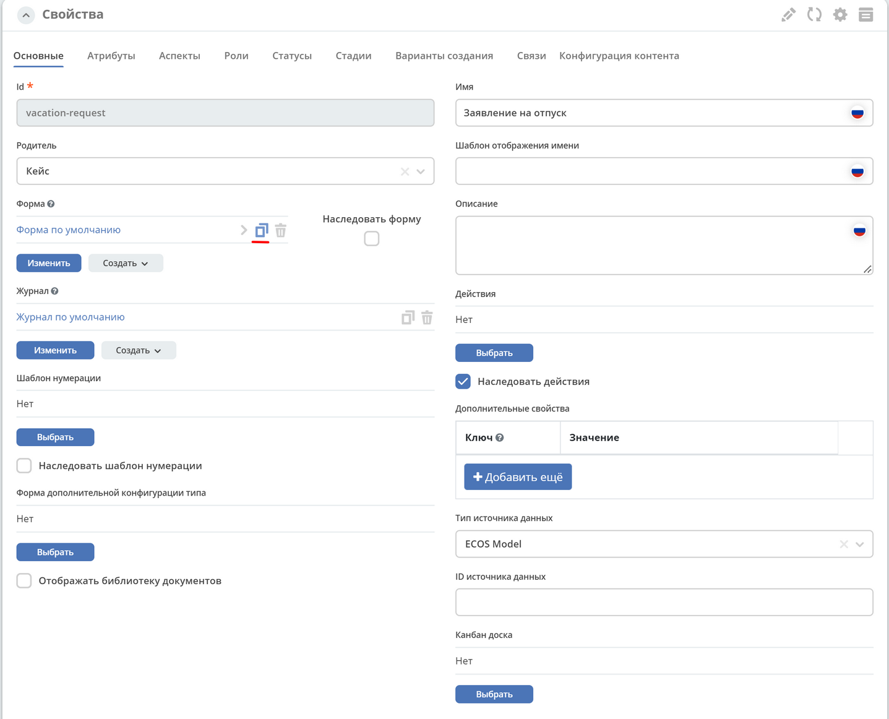
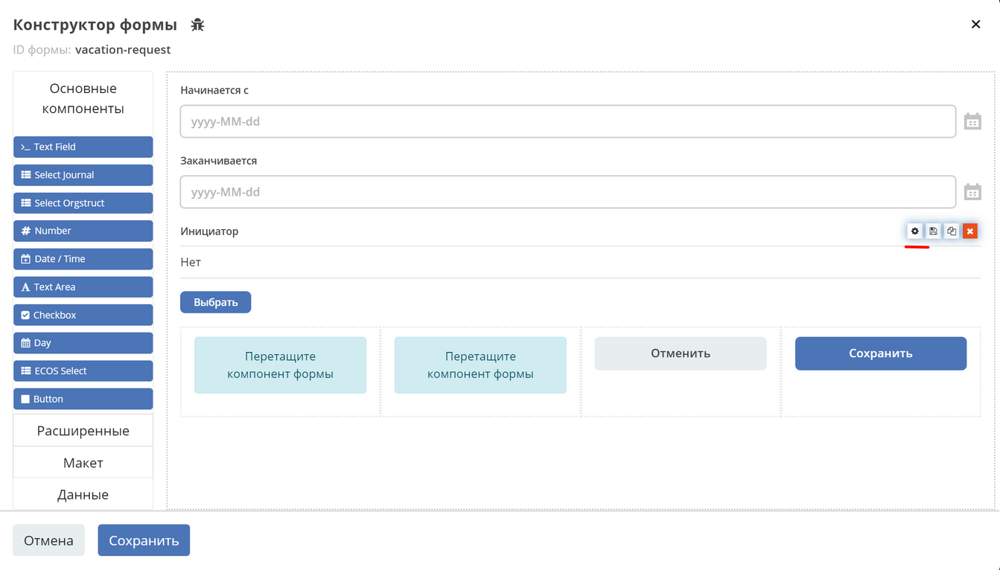
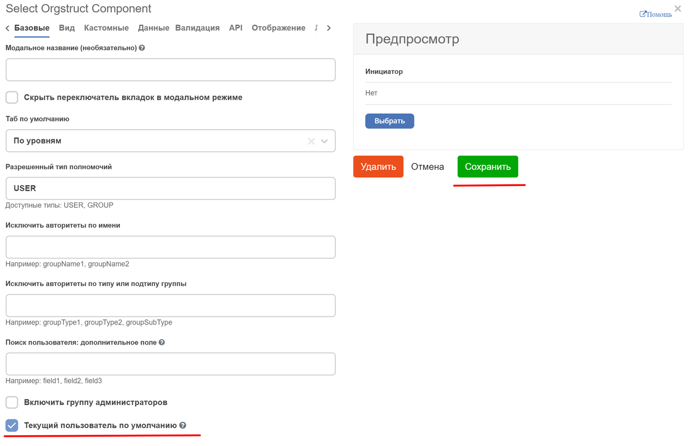

.. _data_types:

Типы данных
============

.. contents::
		:depth: 3

Общий обзор (Overview)
------------------------

**Тип данных** - основной артефакт ECM, описывающий объект. В типе данных определяются метаданные, которые будет содержать объект, статусы жизненного цикла, роли, которые могут работать с объектом. Тип данных связан с формой и журналом.

Типы ECOS - артефакты с типом **model/type**.

В ECOS на основе типа данных создаются следующие артефакты:

  * :ref:`Форма<forms>`
  * :ref:`Журнал<journals>`

.. _data_types_types:

Иерархия системных типов и логика их наследования
~~~~~~~~~~~~~~~~~~~~~~~~~~~~~~~~~~~~~~~~~~~~~~~~~~

У каждого типа данных должен быть родитель. Базовые типы данных:

 .. image:: _static/data_types/type_1.png
       :width: 300
       :align: center

**Кейс (case)** - тип для хранения записи, изменяемой во времени посредстовом связи ее с бизнес-процессом (не явлется статической). Маркером того, что тип будет кейсом является необходимость прикрепления к нему процесса и указания при создании общей информации, атрибутов, ролей, статусов и матрицы прав.

**Справочник (datalist)** - тип для хранения наборов бизнес-данных, которые будут использоваться как статические данные для документов, не участвующие непосредственно в бизнес-процессах. Маркером того, что тип будет даталистом является указание при его создании только общей информации и перечня атрибутов.

В качестве родителя можно использовать созданный ранее тип данных.

Родительские атрибуты попадают в список **наследуемых атрибутов** (:ref:`Атрибуты<ecos-model_label>`) и по флагу **«Наследовать»** можно наследовать форму, действия, шаблон нумерации.

.. _data_types_admin:

Описание перехода к разделу через интерфейс
~~~~~~~~~~~~~~~~~~~~~~~~~~~~~~~~~~~~~~~~~~~~

Для просмотра существующих типов и их редактирования создан журнал **Типы данных (Раздел администратора - Модель - Типы данных)**:

 .. image:: _static/data_types/type_2.png
       :width: 600
       :align: center

По умолчанию в журнале типов данных системные типы не отображаются.

Для отображения **ТОЛЬКО** системных типов перейдите в настройки таблицы, выставите **Системный тип - Да**:

 .. image:: _static/data_types/system_types.png
       :width: 600
       :align: center

Варианты получения экземпляра типа
~~~~~~~~~~~~~~~~~~~~~~~~~~~~~~~~~~~

Тип данных можно создать или загрузить уже созданный в систему.

Создание
"""""""""

Подробнее см. раздел ниже

Для создания типа данных необходимо нажать **+ - Создать новый тип**:

 .. image:: _static/data_types/new_type_1.png
       :width: 400
       :align: center

Откроется форма создания типа данных:

 .. image:: _static/data_types/new_type.png
       :width: 600
       :align: center

Загрузка
"""""""""

Для загрузки созданного типа данных необходимо нажать **+ - Загрузить тип**:

 .. image:: _static/data_types/download_type.png
       :width: 400
       :align: center

Файл формата .yaml

Пример описания типа
~~~~~~~~~~~~~~~~~~~~~

.. code-block:: yaml

    id: hr-offices-type
    name:
      ru: Офисы
    storageType: ECOS_MODEL
    parentRef: emodel/type@data-list
    formRef: uiserv/form@hr-offices-form
    journalRef: uiserv/journal@hr-offices-journal
    inheritActions: false
    defaultCreateVariant: true
    model:
    attributes:
        - id: officesCode
          name:
            ru: Код
        - id: officesCity
          name:
            ru: Город
        - id: officesAddress
          name:
            ru: Адрес

Доступные действия с записью
-----------------------------

 .. image:: _static/data_types/actions.png
       :width: 500
       :align: center

В журнале администратору с каждой записью доступен стандартный набор действий:

  - скачать в виде json-файла;
  - удалить;
  - открыть карточку в соседней вкладке;
  - открыть на редактирование;
  - редактировать json-файл;
  - копировать.

Создание нового типа
----------------------

Форма создания нового типа состоит из следующих вкладок:

 .. image:: _static/data_types/tabs.png
       :width: 600
       :align: center

:ref:`Основные<data_types_main>` – основные характеристики типа данных.

:ref:`Атрибуты<ecos-model_label>`– характеристика, определяющая свойства объекта.

:ref:`Аспекты<type_aspects>`– функционал расширения типа данных без изменения самого типа.

:ref:`Роли<roles_statuses>` – роли, которые участвуют в работе с объектом.

:ref:`Статусы<roles_statuses>`– статусы, по которым объект будет перемещаться по мере выполнения бизнес-процесса.

:ref:`Стадии<stages>`– этапы жизненного цикла документа. 

:ref:`Варианты создания<create>` – настройка поддержки выбора варианта создания после выбора типа

:ref:`Связи<datatypes_associations>` – настраиваются для отображения, добавления и удаления связанных объектов в виджете «Связи»» на карточке объекта.

:ref:`Конфигурация контента<datatypes_content>` – настройки работы с содержимым (контентом).

.. _data_types_main:

Основные
~~~~~~~~~

 .. image:: _static/data_types/tab_main.png
       :width: 600
       :align: center

**Родитель, форму, журнал**, указанные по умолчанию можно изменять.

.. list-table:: 
      :widths: 10 30 30 30
      :header-rows: 1
      :align: center
      :class: tight-table 

      * - п/п
        - Наименование
        - Описание
        - Пример заполнения
      * - 1
        - **Id (обязательное)**
        - уникальный идентификатор типа
        - test_type (snake case)
      * - 2
        - **Имя**
        - локализованное название компонента
        - Тестовый тип
      * - 3
        - **Шаблон отображения имени**
        - | локализованный шаблон заголовка записи, отображаемого при запросах ее локализованного имени (расширеный вариант для параметра п.2). 
          | Поддерживает выражения с использованием данных записи
        - Тестовый тип № ${counter}
      * - 4
        - **Описание**
        - локализованное описание данного типа ECOS (необязательно).
        - Тип, используемый для тестовых целей
      * - 5
        - **Родитель**
        - тип данных, на основании которого, создается текущий. 
        - | выбирается из списка предлагаемых: 
          | :ref:`Кейс (по умолчанию), Справочник <data_types_types>`
          | Остальное – иные созданные ранее типы данных.
      * - 6
        - **Форма**
        - | ссылка на форму, которая будет открываться при инициировании создания записи данного типа.
          | Наследование формы позволяет не заполнять в дочернем типе поле **"форма"**, это поле в итоге заполнится значением из родительского типа.
        - есть вариант создания автоматически по умолчанию (Форма по умолчанию), создания вручную (Создать-Создать форму), загрузки (Создать-Загрузить форму).
      * - 7
        - **Журнал**
        - ссылка на журнал, который будет отображать записи данного типа
        - есть вариант создания автоматически по умолчанию (Журнал по умолчанию), создания вручную (Создать-Создать журнал), загрузки (Создать-Загрузить журнал).
      * - 8
        - **Шаблон нумерации**
        - шаблон нумерации :ref:`См. Шаблоны нумерации<number_template>`
        - выбирается из списка предлагаемых
      * - 9
        - **Форма дополнительной конфигурации типа**
        - [уточнить]
        - 
      * - 10
        - **Журнал**
        - 	Отображать библиотеку документов
        - 
      * - 11
        - **Действия**
        - | Cсылки на действия, которые будут доступны в соответсвующем виджете всех записей данного типа, а также в журнале, связанном с типом (:ref:`подробнее о действиях<ui_actions>`).
          | Возможно наследование дейсвтий от родительского или же наоборот его запрет (управляется проставлением соответсвующего флага)
        - выбирается из списка предлагаемых
      * - 12
        - **Дополнительные свойства**
        - [уточнить]
        - 
      * - 13
        - **Тип источника данных**
        - хранилище, в которое будут заноситься записи данного типа (название отражает не использумую БД, а сервис, в БД которого будут направляться запросы).
          Значение "По умолчанию" означает, что для места хранения будет использоваться "ID источника данных (14)" из текущего или родительского
          типа и при этом не будет никакого автоматического создания хранилища. Т.е. при типе источника данных "По умолчанию" предполагается, что место хранения уже подготовлено заранее.
        - выбирается из списка предлагаемых. 
      * - 14
        - **ID источника данных**
        - иденифтикатор источника для случая, когда используется хранилище не встроенное по умлочанию в систему (в случае когда в п.14 выбран выриант Custom)
        - test_datasource (snake case)
      * - 15
        - **Канбан доска**
        - выбор канбан-доски :ref:`См. Канбан-доска<kanban_board>`
        - 

Создание и редактрование журнала, формы из типа данных
""""""""""""""""""""""""""""""""""""""""""""""""""""""""

Рассмотрим на примере журнала:

 .. image:: _static/data_types/new_journal.png
       :width: 400
       :align: center

При нажатии на **"Создать-создать журнал"** открывается форма создания журнала:

 .. image:: _static/data_types/new_journal_1.png
       :width: 400
       :align: center

При нажатии на **"Создать-загрузить журнал"** открывается форма загрузки журнала:

 .. image:: _static/data_types/new_journal_2.png
       :width: 400
       :align: center

Функциональность реализована в настройках компонента :ref:`Select Journal во вкладке "Кастомные"<Select_journal>`

При нажатии на **"Изменить"** открывается журнал, содержащий все созданные в системе журналы:

 .. image:: _static/data_types/new_journal_3.png
       :width: 400
       :align: center

При нажатии на **Редактировать** открывается форма редактирования соответствующей выбранной сущности на новой вкладке.

.. _ecos-model_label:

Атрибуты
~~~~~~~~~

 .. image:: _static/data_types/tab_attributes.png
       :width: 600
       :align: center

.. list-table:: 
      :widths: 10 30 30 30
      :header-rows: 1
      :align: center
      :class: tight-table 

      * - п/п
        - Наименование
        - Описание
        - Пример заполнения
      * - 1
        - **Id**
        - идентификатор поля, по которому оно будет доступно на форме, в журнале.
        - testAttribute (camelCase)
      * - 2
        - **Имя**
        - имя поля для отображения пользователю.
        - Тестовый атрибут
      * - 3
        - **Тип**
        - тип поля. :ref:`Поддерживаемые типы<ecos-model_types>`
        - выбирается из списка предлагаемых. По умолчанию выставляется text.
      * - 4
        - **Множественный**
        - множественный ввод разрешен
        - флаг
      * - 5
        - **Обязательный**
        - поле обязательно к заполнению
        - флаг
      * - 6
        - **Настройка прав для атрибута**
        - функционал, позволяющий произвести настройку прав доступа в отношении "Роль-Статус" для конкретного атрибута. :ref:`См. подробно<count_attributes>`
        - выбирается состояние доступа атрибута на пересечении сетки "Роль-Статус"
      * - 7
        - **Вычисляемые атрибуты**
        - функионал, позволяющий установить выражение-зависимость, позволяющий гибко создавать производные атрибуты :ref:`См. подробно<attribute_rights>`
        - настройка конфигурации в зависимости от типа и сложности вычисления атрибута
      * - 8
        - **Наследуемые атрибуты**
        - отображение значений наследумых от родительского типа атрибутов в соответсвии с п. 1, 2 и 6 (при условии что родительский тип задан и имеет атрибуты)
        - отсутствует
      * - 9
        - **Настройка прав для типа данных**
        - | функционал, позволяющий произвести настройку прав доступа документа в отношении "Роль-Статус".
          | А также выгрузить и удалить полную схему прав (включая настройки из п.6) :ref:`См. подробно<doc_rights>`
        - выбирается состояние доступа документа на пересечении сетки "Роль-Статус"

.. _ecos-model_types:

Возможные типы атрибутов:
"""""""""""""""""""""""""

.. list-table:: 
      :widths: 10 20
      :align: center
      :class: tight-table 

      * - **Text**
        - текст
      * - **MLText**
        - текст с локализацией. Содержание меняется в зависимости от выбранной локализации.
      * - **Person**
        - пользователь из оргструктуры
      * - **Group**
        - группа пользователей из оргструктуры
      * - **Authority**
        - пользователь или группа. Это по сути базовый тип и для пользователей и для групп
      * - **Association**
        - | связь с другой сущностью
          | По кнопке **"Настроить"** выбрать тип данных и при необходимости выставить признак дочерней ассоциации:

          .. image:: _static/data_types/association_type.png
                :width: 400
                :align: center

      * - **Number**
        - число
      * - **Boolean**
        - булево значение да/нет;
      * - **Date**
        - дата
      * - **DateTime**
        - дата с временем;
      * - **Content**
        - содержимое. Как правило поля с этим типом используются для сохранения больших объемов данных. Например - содержимое документа. 
      * - **JSON**
        - текстовый, структурированный формат данных. Например:

          .. code-block:: json

            {"some": "data"}         
      * - **Binary**
        - | массив байт. Похож на контент, но намного проще. 
          | Не рекомендуется здесь хранить более 1мб данных.

.. _count_attributes:

Вычисляемые атрибуты
"""""""""""""""""""""

 .. image:: _static/data_types/count_1.png
       :width: 600
       :align: center

|

 .. image:: _static/data_types/count_2.png
       :width: 400
       :align: center

**Тип** - тип вычисляемого атрибута. Поддерживаются:

    * **Script** - вычисление атрибута на основе ``javascript'а``;
    * **Attribute** - вычисление атрибута на основе другого атрибута (можно делать алиас на глубоко вложенный атрибут. Например: ``idocs:counterparty.idocs:fullOrganizationName?str)``;
    * **Значение** - константное значение;
    * **Counter** - значение будет генерироваться по счетчику при создании документа и не меняться со временем.
    * **Template** - шаблонная строка. Можно использовать вставки вида ${…}. Например: ``${someAttribute?str}``. Вместо данного плейсхолдера будет подставлено значение укзанного атрибута;

 .. image:: _static/data_types/count_3.png
       :width: 400
       :align: center

 **Метод хранения** - тип сохранения. Определяет, нужно или нет сохранять вычисленное значение и если да, то в какие моменты. Возможные значения:

    * **None** - сохранение не нужно. При каждом обращении вычисляем значение заново;
    * **On empty** - сохранять вычисленное значение только если сохраненное значение отсутствует (т.е. при запросе значения вернулся ``null``);
    * **On create** - сохранять вычисленное значение только после создания. Последующие мутации никак данный атрибут не затронут и он будет работать как обычный атрибут.
    * **On mutate** - сохранять вычисленное значение при каждой мутации. В случае использования :ref:`Records API<Records_API>`  для изменения записи гарантируется актуальность значения.

Возможности атрибута с типом **script**
****************************************

Объекты в глобальной области видимости:

.. list-table:: 
      :widths: 10 20
      :align: center
      :class: tight-table 

      * - **Records** - адаптер для RecordsService;
        - Методы:

            .. code-block:: text

              get(recordRef: String): AttValueScriptCtx // возвращает объект аналогичный value, который описан выше
              query(query: Object, attributes: Any?) // возвращает объект вида:

            .. code-block::  json

              {
                  "records": [{
                          "id": "workspace://...",
                          "attribute0": "value0",
                          "attribute1": "value1"
                      }, {
                          "id": "workspace://...",
                          "attribute00": "value00",
                          "attribute11": "value11"
                      }
                  ],
                  "totalCount": 123
                  "hasMore": true
              }

      * - **value** - текущий документ;
        - |  Свойства

            .. code-block:: text

                id: String //глобальный идентификатор записи
                localId: String //локальный идентификатор записи

          | Методы:

            .. code-block:: text

              load(attributes: Any?): Any? // загрузка атрибутов у текущей записи. Можно передавать массив, строку и объект <String, String>

          | Пример:
          | Вычислить атрибут на основе трех других:

            .. code-block::

              var firstName = value.load('firstName');
              var lastName = value.load('lastName');
              return lastName + ' ' + firstName;

      * - **log** - логгер.
        - [уточнить]

.. warning:: Прикладных сервисов в контексте скрипта нет.

.. _permissions:

Матрица прав
"""""""""""""

**Матрица прав** - таблица, которая показывает, какими правами обладает конкретная роль на отдельные виды данных.

Права могут быть настроены отдельно на документ, отдельно на его атрибуты.

Настройка прав
****************

Настройка прав осуществляется на форме редактирования типа во вкладке :guilabel:`Атрибуты`. Редактор доступен только в **Enterprise** версии ECOS.

.. _doc_rights:

Права на документ:

 .. image:: _static/data_types/matrix_1.png
       :width: 600
       :align: center

|

 .. image:: _static/data_types/matrix_2.png
       :width: 400
       :align: center

.. _attribute_rights:

Права на атрибут:

 .. image:: _static/data_types/matrix_3.png
       :width: 600
       :align: center

|

 .. image:: _static/data_types/matrix_4.png
       :width: 400
       :align: center

Вычисление прав
****************

Вычисление прав для **PermissionsDef** (документа или атрибута) делится на два этапа:

**1. Применение матрицы прав** <*Роль, <Статус, Уровень_прав*>>. Есть 3 уровня прав: 

* NONE - нет прав;
* READ - чтение;
* WRITE - чтение и запись.

**2. Применение правил**. Правила нужны в случаях, когда логика распределения прав не укладывается в простую матрицу. Примеры: 

* Если есть 2 состояния документа в одном статусе, но с разными правами;
* Если уровень прав зависит от атрибутов документа.

Значения, которые вычисляются на этапах 1 и 2 должны быть абсолютными. Т.е. если у нас есть конфигурация прав, то она на 100% описывает текущий уровень прав и не предполагает наличие дополнительных механизмов.

* Роли и статусы берутся из конфигурации типа. Если какой-то роли или статуса нет в конфигурации типа, то наличие этих сущностей в конфиге прав игнорируется.
* Если для роли, статуса или атрибута нет настройки прав, но они присутствуют в типе, то по умолчанию выставляется право только на чтение.
* Если у документа выставлен статус или есть роль, которые отсутствуют в конфиге типа, то права для них по умолчанию пустые (нет возможности даже читать).

Пограничные условия
*********************

Данные условия относятся к настройкам матрицы без системных статусов и ролей.

.. csv-table::
 :header: "Статус есть в типе","Статус есть в матрице","Роль есть в типе","Роль есть в матрице","Уровень прав"
 :widths: 10, 10, 10, 10, 20

 "Да","Да","Да","Да","Из матрицы"
 "Да","Да","Да","Нет","Чтение"
 "Да","Да","Нет","Да","Нет прав"
 "Да","Да","Нет","Нет","Нет прав"
 "Да","Нет","Да","Да","Чтение"
 "Да","Нет","Да","Нет","Чтение"
 "Да","Нет","Нет","Да","Нет прав"
 "Да","Нет","Нет","Нет","Нет прав"
 "Нет","Да","Да","Да","Нет прав"
 "Нет","Да","Да","Нет","Нет прав"
 "Нет","Да","Нет","Да","Нет прав"
 "Нет","Да","Нет","Нет","Нет прав"
 "Нет","Нет","Да","Да","Нет прав"
 "Нет","Нет","Да","Нет","Нет прав"
 "Нет","Нет","Нет","Да","Нет прав"
 "Нет","Нет","Нет","Нет","Нет прав"

Системные статусы и роли
*************************

При необходимости можно настроить в типе системные статусы и роли. Для этого достаточно указать **ID** равным одному из предопределенных значений:

**Роли:**

1. **EVERYONE** - виртуальная роль, к которой относятся все пользователи. *Assignees* у такой роли всегда пустые, но если роль **EVERYONE** по матрице получает права, то они распространяются на всех пользователей в системе.

**Статусы:**

1. **EMPTY** - пустой статус. Полезен для приватных сущностей, которые недоступны на чтение всем пользователям в системе. Пустой статус может быть в случае если процесс для кейса не найден или операция старта процесса еще не завершилась;
2. **ANY** - любой статус. Вариант использования: для справочников можно задать права для **ANY** и **EVERYONE** на чтение, а для изменения записей завести отдельную группу.

Модель описания прав
*********************

Основная логика находится в библиотеке **ecos-model-lib**.

Конфигурация прав хранится в микросервисе **ecos-model**.

::

	 TypePermsDef 
	 id: String // Идентификатор настроек. Уникальный в пределах системы
	 typeRef: RecordRef // Тип ECOS, к которому относятся настройки прав
	 permissions: PermissionsDef // Настройка прав на документ
	 attributes: Map<String, PermissionsDef> // Настройка прав на атрибуты

::
 
	PermissionsDef
	 matrix: Map<String, Map<String, PermissionLevel>> // Матрица прав <Роль, <Статус, Уровень_прав>>. 
	 rules: List<PermissionRule> // Дополнительные правила для гибкой настройки 

::
 
	 PermissionLevel (enum)
	 NONE // нет прав
	 READ // права на чтение
	 WRITE // права на чтение и запись

::

	 PermissionRule
	 roles: Set<String> // Роли, для которых применяется правило
	 permissions: Set<String> // Список прав
	 statuses: Set<String> // Статусы, в которых данное правило применимо. Пустой список - любой статус
	 condition: Predicate // Условие, по которому данное правило применимо в формате предиката (см. Язык предикатов).
	 type: RuleType // Тип правила

	 RuleType (enum)
	 ALLOW - разрешение. Если правило активно, то permissions добавляются для указанных ролей
	 REVOKE - отбирание прав. Если правило активно, то permissions убираются из списка уже существующих прав у ролей

Наследование прав
*******************
При поиске матрицы прав учитывается иерархия типов ECOS. При этом ищется первая не пустая конфигурация и дальше поиск прекращается. Т.е. никакого объединения настроек прав из разных типов не происходит.  

**Пример конфигурации**

::

 id: "2a5c3f00-06d5-4b62-8192-1b9116f12db4"
 typeRef: "emodel/type@contracts-cat-doctype-contract"

 permissions

  matrix:
    confirmers:
      approval: WRITE
      reworking: NONE
    initiator:
      approval: READ
      reworking: WRITE
    scan-man:
      approval: WRITE
      reworking: NONE
  rules: []

 attributes::

  cm:name:
    matrix:
      confirmers:
        approval: WRITE
        reworking: NONE
      initiator:
        approval: READ
        reworking: WRITE
      scan-man:
        approval: WRITE
        reworking: NONE
    rules: []

  cm:title:
    matrix:
      confirmers:
        approval: WRITE
        reworking: NONE
      initiator:
        approval: READ
        reworking: WRITE
      scan-man:
        approval: WRITE
        reworking: NONE
    rules: []

.. _type_aspects:

Аспекты
~~~~~~~~~

 .. image:: _static/data_types/tab_aspects.png
       :width: 600
       :align: center

Выберите спект из списка. По кнопке **"Настроить"** можно отредактировать конфигурацию - открывается форма, настроенная для :ref:`аспекта<aspects_user>`. 

Атрибуты из добавленных аспектов будут доступны в создаваемом типе данных.

.. _roles_statuses:

Роли
~~~~~

 .. image:: _static/data_types/tab_roles.png
       :width: 600
       :align: center

.. list-table:: 
      :widths: 10 30 30 30
      :header-rows: 1
      :align: center
      :class: tight-table 

      * - п/п
        - Наименование
        - Описание
        - Пример заполнения
      * - 1
        - **Id**
        - уникальный идентификатор роли
        - myTestRole (camel case)
      * - 2
        - **Название логики**
        - имя роли
        - Тестовая роль
      * - 3
        - **Участники роли**
        - | статическое заполнение роли. 
          | Выбор группы и/или отдельных пользователей из оргструктуры, которые будут выполнять функцию данной роли.
        - выбирается из списка оргуструктуры организации
      * - 4
        - **Атрибуты**
        - динамическое заполнение роли. Выбор атрибута типа, на который будет ссылаться роль для получения назначаемых пользователей.
        - выбирается из списка предлагаемых атрибутов
      * - 5
        - **Динамическая роль**
        - | динамическое заполнение роли. 
          | Установление произвольной гибкой логики, по которой будет произведено вычисление состава пользователей роли. 
        - настройка конфигурации в зависимости от сложности и набора заивисимых данных для вычисления состава роли

.. note::

  Все назначенные роли (статические, динамические, атрибутивные) объединяются.

.. _associations:

Статусы
~~~~~~~

 .. image:: _static/data_types/tab_statuses.png
       :width: 600
       :align: center

.. list-table:: 
      :widths: 10 30 30 30
      :header-rows: 1
      :align: center
      :class: tight-table 

      * - п/п
        - Наименование
        - Описание
        - Пример заполнения
      * - 1
        - **Id**
        - уникальный идентификатор статуса
        - testStatus (camel case)
      * - 2
        - **Название логики**
        - имя статуса
        - Тестовый статус

На форме документа статус может быть отражен следующим образом:

 .. image:: _static/data_types/form_status.png
       :width: 600
       :align: center

В компоненте  :ref:`Text field <Text_Field>`:

- название поля может быть любым, 
- имя свойства -  **_status**, 
- скрыть и заблокировать на ввод, если необходимо не отображать на форме.

.. _stages:

Стадии
~~~~~~

**Стадии** — этапы жизненного цикла документа. В каждую стадию входит один или несколько статусов.

 .. image:: _static/data_types/tab_stages.png
       :width: 600
       :align: center

Прежде, чем приступить к работе над стадиями, необходимо заполнить :ref:`Статусы<roles_statuses>`.

.. list-table:: 
      :widths: 10 30 30 30
      :header-rows: 1
      :align: center
      :class: tight-table 

      * - п/п
        - Наименование
        - Описание
        - Пример заполнения
      * - 1
        - **Название стадии**
        - Наименование стадии
        - testStage (camel case)
      * - 2
        - **Статусы**
        - Перечень статусов, входящих в стадию
        - Выбирается из списка предлагаемых статусов

Каждый статус может быть назначен только на одну стадию:

 .. image:: _static/data_types/tab_stages_2.png
       :width: 600
       :align: center

Стадии отображаются в виджете :ref:`виджете "Стадии"<widget_stages>`

.. _create:

Варианты создания
~~~~~~~~~~~~~~~~~~

Настройка поддержки выбора варианта создания после выбора типа настраиваются на вкладке :guilabel:`Варианты создания`

 .. image:: _static/data_types/tab_create.png
       :width: 600
       :align: center

.. list-table:: 
      :widths: 10 30 30 30
      :header-rows: 1
      :align: center
      :class: tight-table 

      * - п/п
        - Наименование
        - Описание
        - Пример заполнения
      * - 1
        - **Id**
        - уникальный идентификатор варианта создания
        - testCreate (camel case)
      * - 2
        - **Имя**
        - имя поля для отображения пользователю.
        - Тестовый статус
      * - 3
        - **Форма**
        - имя поля для отображения пользователю.
        - Тестовый статус
      * - 4
        - **Разрешен для**
        - пользователь или группа, для которых разрешен функционал.
        - 
      * - 5
        - **Дополнительно**
        - дополнительные настройки.
        - 

|

.. image:: _static/data_types/create_full_1.png
       :width: 300
       :align: center

.. _datatypes_associations:

Связи 
~~~~~~

.. list-table:: 
      :widths: 10 30 30
      :header-rows: 1
      :align: center
      :class: tight-table 

      * - п/п
        - Наименование
        - Описание
      * - 1
        - **Id**
        - | идентификатор связи. Обязательное поле (если не заполнено, то сервер такую связь не сохраняет). 
          | Это поле нужно для:
          | 1. Перезаписывания конфигурации связи в дочернем типе. Т.е. если мы в дочернем типе укажем тот же ID, то по сути перезатрем конфигурацию связи
          | 2. Указание атрибута, в котором связь сохранится (если не задано значение в поле "Атрибут")
      * - 2
        - **Имя**
        - имя связи для отображения в интерфейсе
      * - 3
        - **Атрибут**
        -  | в который новые связи будут добавляться и из которого будут загружаться. 
           | Как правило это ассоциация из вкладки :guilabel:`Атрибуты`. Если не задано то используется значение поля ID.
      * - 4
        - **Направление связи**
        - | определяет какие связи отображать в виджете связей. Любая связь строится по принципу **SOURCE -> TARGET**
          | - **SOURCE** - обратное к **target** связь у источника. При открытии карточки **TARGET** мы увидим нашу связь. При открытии карточки **SOURCE** мы ничего не увидим.
          | - **TARGET** - связь отображается только у документа, который хотим привязать. При открытии карточки **TARGET** мы ничего не увидим. При открытии карточки **SOURCE** мы увидим нашу связь.
          | - **BOTH** - двухсторонняя связь. И на карточке **SOURCE** и на карточке **TARGET** увидим нашу связь.
      * - 5
        - **Связанный тип**
        - тип сущностей, с которыми мы можем связать нашу ноду
      * - 6
        - **Журналы**
        - список журналов, которые можно использовать для создания новой связи. Если необходимо создавать связи не с одним определенным типом.

Для добавления возможности связать документ с простой ссылкой (**Id** - webLinks, **Направление связи** - TARGET):

.. image:: _static/data_types/association_example_weblink.png
       :width: 600
       :align: center

**Связи (associations)** настраиваются для отображения, добавления и удаления связанных объектов в виджете Формы :ref:`«Связи документов»<widget_doc_associations>` на карточке объекта.

.. image:: _static/data_types/connections.png
       :width: 400
       :align: center

.. _datatypes_content:

Конфигурация контента
~~~~~~~~~~~~~~~~~~~~~~~~

Работа с контентом в ECOS осуществляется с использованием атрибутов ECOS типа с типом **"Содержимое"**.

Атрибут _content
""""""""""""""""""

Атрибут **_content** служит для доступа к основному контенту записи без необходимости узнавать в каком именно атрибуте
хранится контент. По умолчанию атрибут с контентом - content, но этот атрибут можно переопределить в типе во вкладке :guilabel:`Конфигурация контента`.

При загрузке нового контента в свойство **“_content”** имя содержимого записывается в свойство **name** сущности (если оно определено в атрибутах). 

Контент в свойстве **_content** всегда имеет имя, которое совпадает с именем сущности (оно переопределяет имя самого контента).

Настройка типа
"""""""""""""""

.. image:: _static/data_types/tab_content.png
       :width: 600
       :align: center

.. list-table:: 
      :widths: 10 30 30
      :header-rows: 1
      :align: center
      :class: tight-table 

      * - п/п
        - Наименование
        - Описание
      * - 1
        - **Атрибут с основным контентом**
        - | атрибут, в котором находится контент, который доступен через свойство **“_content”**.
          | Может быть сложным с указанием свойства из связанной сущности. Например - **“linkedRecord.content”**. 
          | Если это поле оставить пустым, то основным полем с контентом будет **“content“**.

      * - 2
        - **Тип хранилища**
        - | атрибут, в котором находится контент, который будет использоваться для предпросмотра документа. 
          | Если не указать значение, то используется “Атрибут с основным контентом”
      * - 3
        - **Атрибут с контентом для предпросмотра**
        - | место где будет сохраняться контент. 
          | По умолчанию **“local“**, что в свою очередь означает, что контент будет сохраняться в БД в той же схеме, что и таблица сущностей нашего типа. 
          | Другие типы хранилища пока не поддерживаются.

Java
""""""

Для работы в java с контентом следует использовать интерфейс EcosContentApi:

Загрузка:

.. code-block:: java

  EntityRef tempFile = contentApi.uploadTempFile()
      .withMimeType("application/pdf")
      .writeContent((writer) -> writer.writeBytes(imageContent1));

  ObjectData attributeForMutation = ObjectData.create()
      .set("customContentAtt", tempFile);

  // Создание 
  EntityRef newFileWithContent = recordsService.create("emodel/test", attributeForMutation);
  // Обновление
  recordsService.mutate(newFileWithContent, attributeForMutation);

Чтение:

.. code-block:: java

  EntityRef ref = EntityRef.valueOf("emodel/test@localId");
  EcosContentData contentData = contentApi.getContent(ref, "attributeWithContent");
  if (contentData == null) {
      throw new RuntimeException("Content is null");
  }
  // При работе с файлами, максимальный размер которых может быть более ~20мб
  // чтение контента в массив байт следует по возможности избегать. Иначе есть риск получить OutOfMemoryError
  byte[] bytes = contentData.readContent(reader -> {
      try {
          return IOUtils.toByteArray(reader);
      } catch (Exception e) {
          throw new RuntimeException(e);
      }
  });

Отображаемое имя сущности
--------------------------

Есть несколько сценариев для работы с отображаемым именем сущности.

    1. Если необходимо, чтобы имя сущности всегда формировалось по шаблону, то следует использовать поле **dispNameTemplate** в типе;

    2. Если необходимо, чтобы именем сущности можно было управлять, то следует в список атрибутов добавить атрибут с **id = ‘name'**. Система автоматически будет использовать это поле для отображаемого имени (скаляр **?disp** в Records API)

        a. Можно вывести поле name на форму и тогда пользователь сможет сам им управлять

        b. Можно поле **name** не выводить на форму, но позволить пользователю работать с **“_content”** атрибутом. В этом случае при загрузке нового контента автоматически будет изменяться поле name и => отображаемое имя.

.. _auto_journal_form:

Автоматически сгенерированные формы и журналы в типе данных
------------------------------------------------------------

Для типа данных доступны автоматически генерируемая форма и журнал:

.. image:: _static/data_types/auto_1.png
       :width: 600
       :align: center

Рассмотрим подробнее на примере. Заполним атрибуты типа данных:

|

На форме типа после создания становятся доступны действия с автосгенерированными формой и журналом: 

.. _auto_journal:

Журнал
~~~~~~~

Журнал получает идентификатор – **type$idтипа**, название - как и тип данных, и может полноценно использоваться в системе – может быть добавлен в :ref:`меню<menu_add>`:

|

Перейти в журнал и создать элемент журнала:

.. image:: _static/data_types/auto_19.png
       :width: 600
       :align: center

|

Перейдем в журнал **«Журналы»**:

.. image:: _static/data_types/auto_20.png
       :width: 600
       :align: center

|

Автосгенерированный журнал нельзя редактировать, т.к. он генерируется на лету при каждом обращении.

Для журнала доступны действия: 

  -	скачать,
  -	редактировать json,
  -	копировать,
  -	открыть журнал в соседней вкладке.

По нажатию на *глаз* открывается дашборд для просмотра свойств сгенерированной журнала:

.. _auto_form:

Форма
~~~~~~

Для созданного типа данных для формы доступны следующие действия: 

.. list-table:: 
      :widths: 10 60
      :align: center

      * - 

          .. image:: _static/data_types/auto_4.png
                  :width: 30
                  :align: center

        - | Тестировать форму - как будет выглядеть форма в итоговом виде:

          .. image:: _static/data_types/auto_5.png
                  :width: 400
                  :align: center

          | Для просмотра формы необходимо нажать **Submit**:

          .. image:: _static/data_types/auto_6.png
                  :width: 400
                  :align: center

          | На форме присутствуют поля в соответствии с данными и типом, указанным в атрибутах.

      * - 

          .. image:: _static/data_types/auto_7.png
                  :width: 30
                  :align: center

        - | Автосгенерированную форму можно скопировать, чтобы присвоить идентификатор  и отредактировать под себя. :ref:`См. подробнее ниже<auto_form_change>`

Перейдем в журнал **«Формы»**.

Форма получает идентификатор – **type$idтипа**, название - как у типа данных.

|

Автосгенерированную форму нельзя редактировать.

Для формы доступны действия: 

  -	тестировать форму,
  -	скачать,
  -	редактировать json,
  -	копировать,
  -	открыть форму в соседней вкладке.

По нажатию на *глаз* открывается дашборд для просмотра свойств сгенерированной формы:

.. image:: _static/data_types/auto_9.png
       :width: 700
       :align: center

|

.. _auto_form_change:

Изменение автосгенерированной формы
""""""""""""""""""""""""""""""""""""

Если необходимо изменить форму. Например, чтобы в форме инициатор выбирался автоматически как текущий пользователь.

Для этого необходимо скопировать форму из журнала **«Формы»**, или карточки типа данных.

Переименовать:

.. image:: _static/data_types/auto_11.png
       :width: 400
       :align: center

В типе данных проставляется данная форма и становятся доступны действия, включая редактирование:

.. image:: _static/data_types/auto_12.png
       :width: 600
       :align: center

Нажать **«Редактировать»**:

.. image:: _static/data_types/auto_13.png
       :width: 600
       :align: center

Далее перейти к редактированию компонента:

На вкладке **«Кастомные»** выставить чекбокс **«Текущий пользователь по умолчанию»**, сохранить компонент:

Далее сохранить форму, тип данных.

В журнале **«Формы»** при этом пропадет автосгенерированная форма, т.к. она не выбрана по умолчанию в типе данных.

И добавлена созданная вручную, для которой доступны и редактирование, и удаление:

.. image:: _static/data_types/auto_16.png
       :width: 600
       :align: center

|

Проверим – при создании заявления на отпуск инициатором автоматически проставляется текущий пользователь:

.. image:: _static/data_types/auto_17.png
       :width: 700
       :align: center
