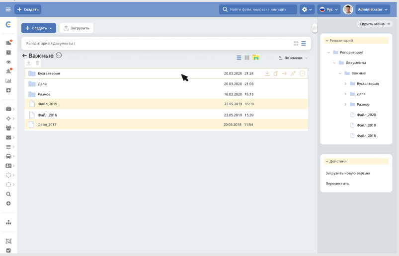

=======================
**Document Library**
=======================

Файловое хранилище
------------------

Document Library - иерархический интерфейс для работы с папками и документами. 

Основная идея в том, что данный интерфейс будет доступен для любого типа ECOS.  Для журнала любого типа можно настроить отображение сущностей в режиме проводника. В данном режиме можно просмотреть дерево иерархии папок и документов, произвести действия над документами и паками по аналогии действиям в проводнике Windows. Таким образом, журнал библиотеки документов можно переключать в один из двух режимов отображения: “список (стандартный режим “Журнал” без указания папок) и “Проводник”. Проводник отображается в правом меню с возможностью его свернуть.

В настройках типа опция “Включить проводник”. В настройках базового типа добавлены дополнительные параметры: - тип папки
- тип документов 
- тип документа по умолчанию. 

Макет
~~~~~~
- В журнале типа добавлена опция “Проводник” (иконка проводника) справа от значка предпросмотра.
- Виджет с деревом библиотеки отображается только, если выбран режим просмотра “Проводник”.
- При выборе нескольких строк журнала доступны групповые действия “скачать” и “удалить“. Иконки групповых действий размещены над журналом.
- Над журналом размещено название текущей раскрытой папки, чуть выше - полный путь к открытой папке.

Вариант макета формы

Иерархия Document Library
-------------------------

Библиотека документов API
-------------------------
Для примеров взят тип **emodel/type@TEST_TYPE**

-   1. Корень для библиотеки документов всегда доступен по составному id: **alfresco/doclib@TEST_TYPE$** (от id типа отбрасывается префикс **emodel/type@**, добавляется префикс **alresco/doclib@** и постфикс **$**)

-   2. Получение дочерних элементов::

	Records.get('alfresco/doclib@TEST_TYPE$').load('children[]{id:?id,displayName:?disp,nodeType,hasChildrenDirs:hasChildrenDirs?bool,typeRef:typeRef?id}');

Все получаемые id нужно проверять на наличие префикса **alfresco/doclib@**. Если возвращается просто **doclib@…**, то нужно добавить **alfresco/** чтобы получилось **alfresco/doclib@**

-   3. Узнать поддерживает ли тип режим doclib::

	Records.get('emodel/type@TEST_TYPE').load('resolvedDocLib.enabled?bool')

-   4. Получить список типов файлов, которые могут быть в данной библиотеке::

	Records.get('emodel/type@TEST_TYPE').load('resolvedDocLib.fileTypeRefs[]?id')

-   5. Получить тип директории в библиотеке документов::

	Records.get('emodel/type@TEST_TYPE').load('resolvedDocLib.dirTypeRef?id')

-   6. Создать новый файл или папку в библиотеке::

	var record = Citeck.Records.get('alfresco/doclib@TEST_TYPE$');
	record.att('_parent', 'alfresco/doclib@TEST_TYPE$workspace://SpacesStore/16fffdd9-c37a-4d4f-8e40-9e698c8f194f'); // для корня библиотеки следует использовать alfresco/doclib@TEST_TYPE$
	record.att('cm:title', 'Папка #1000');
	record.att('_type', 'emodel/type@file'); //здесь должен быть один из типов пункта 4 или пункта 5 (по этому типу определяется, что именно нужно создать - папку или файл)
	record.save();

-   7. Получить дочерние элементы по типу::

	Records.query({
	    sourceId: 'alfresco/doclib',
	    query: {
	        parentRef: 'alfresco/doclib@TEST_TYPE$',
	        nodeType: 'DIR'
	    },
	    language: 'children'
	});

-   8.  Поиск дочерних элементов с фильтрацией (для поиска через полосу поиска над таблицей флаг recursive должен быть true)::

	Records.query({
	    sourceId: 'alfresco/doclib',
	    query: {
	        parentRef: "alfresco/doclib@TEST_TYPE$",
	        recursive: false,
	        filter: {
	            t: 'contains',
	            att: 'ALL',
	            val: '111'
	        }
	    },
	    language: 'children'
	})

-   9. Получение пути для документа (можно объединять с другими атрибутами)::

	Records.get('alfresco/doclib@nsd-attorney$workspace://SpacesStore/fab07cb3-cf5a-4c07-a17a-4e3f56e208d2').load('path[]{disp:?disp,id:?id}')