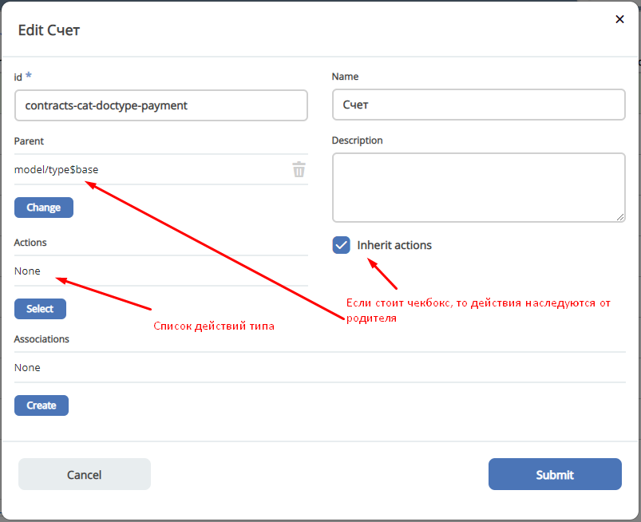

===============
**Действия**
==============

ECOS Actions
------------
Описание работы действий в ECOS
Сущности в системе:

Типы действий
-------------

Расширение действий
-------------------

Добавление новых инстансов действий
~~~~~~~~~~~~~~~~~~~~~~~~~~~~~~~~~~~~~
Для добавления новых инстансов действий необходимо описать их в json виде и добавить их в alfresco (в микросервисы так же можно добавлять действия) по пути

**{alfresco_module_id}/src/main/resources/alfresco/module/{alfresco_module_id}/ui/action**

Пример описания::

 {
    "id": "confirm-list-html",
    "key": "card-template.confirm-list.html",
    "name": "Скачать лист согласования",
    "type": "download-card-template",
    "config": {
        "templateType": "confirm-list",
        "format": "html"
    }
 }

Для тестирования можно заливать эту конфигурацию в журнале действий вручную.

Добавление новых типов действий
~~~~~~~~~~~~~~~~~~~~~~~~~~~~~~~
На данный момент все типы описаны в базовом проекте ecos-ui (в планах есть поддержка расширения действий без изменений в ecos-ui).

Описываем новое действие::

 export const DownloadAction = {
  execute: ({ record, action }) => {
    const config = action.config || {};

    let url = config.url || getDownloadContentUrl(record.id);
    url = url.replace('${recordRef}', record.id); // eslint-disable-line no-template-curly-in-string

    const name = config.filename || 'file';

    const a = document.createElement('A', { target: '_blank' });

    a.href = url;
    a.download = name;
    document.body.appendChild(a);
    a.click();
    document.body.removeChild(a);

    return false;
  },

  getDefaultModel: () => {
    return {
      name: 'grid.inline-tools.download',
      type: 'download',
      icon: 'icon-download'
    };
  },

  canBeExecuted: ({ record }) => {
    return record.att('.has(n:"cm:content")') !== false;
  }
 };

Зарегистрировать новый тип::

 import Registry from './RecordActionExecutorsRegistry';
 import { DownloadAction } from './DefaultActions';

 Registry.addExecutors({
  download: DownloadAction,
 });

Настройки списка действий
-------------------------
Настройка действий на dashboard
~~~~~~~~~~~~~~~~~~~~~~~~~~~~~~~
Настройка действий на dashboard осуществляется в журнале типов кейсов, который располагается в системных журналах:

Настройка действий в журналах
~~~~~~~~~~~~~~~~~~~~~~~~~~~~~
Действия в журнале описываются в разделе actions перед headers и содержат ссылки на те же действия, что и в типах. Если действия не описаны, то используется список действий по умолчанию:

ui/action$content-download
ui/action$edit
ui/action$delete
ui/action$view-dashboard
ui/action$view-dashboard-in-background

Примеры настроек действий::

 <journal id="ecos-sync">
    <datasource>integrations/sync</datasource>
    <create>
        <variant title="Alfresco Records">
            <recordRef>integrations/sync@alfrecords</recordRef>
            <attribute name="type">alfrecords</attribute>
        </variant>
    </create>
    <actions>
        <action ref="ui/action$ecos-module-download" />
        <action ref="ui/action$delete" />
        <action ref="ui/action$edit" />
    </actions>
    <headers>
        <header key="module_id" default="true"/>
        <header key="name" default="true"/>
        <header key="type" default="true"/>
        <header key="syncDate" default="true"/>
        <header key="enabled" default="true"/>
    </headers>
 </journal>
-------------------------

Настройка действия, которое активно для записей с определенным mimetype контента
::

 {
    "id": "edit-in-onlyoffice",
    "key": "edit.onlyoffice",
    "name": "Редактировать Документ",
    "type": "open-url", // тип действия должен соответствовать типу на UI
    "config": {
        "url": "/share/page/onlyoffice-edit?nodeRef=${recordRef}&new="
    },
    "evaluator": {
        "type": "predicate", // Тип evaluator'а для фильтрации действий
        "config": {
            "predicate": {
                "t": "in",
                "att": "_content.mimetype?str", // атрибут, который мы проверяем
                "val": [ //значения, на которые мы проверяем
                    "application/vnd.openxmlformats-officedocument.wordprocessingml.document",
                    "application/vnd.openxmlformats-officedocument.spreadsheetml.sheet",
                    "application/vnd.openxmlformats-officedocument.presentationml.presentation",
                    "text/plain",
                    "text/csv"
                ]
            }
        }
    }
 }

Данный конфиг достаточно положить в ecos-app/ui/action для микросервисов или в {alfresco_module_id}/src/main/resources/alfresco/module/{alfresco_module_id}/ui/action для Alfresco