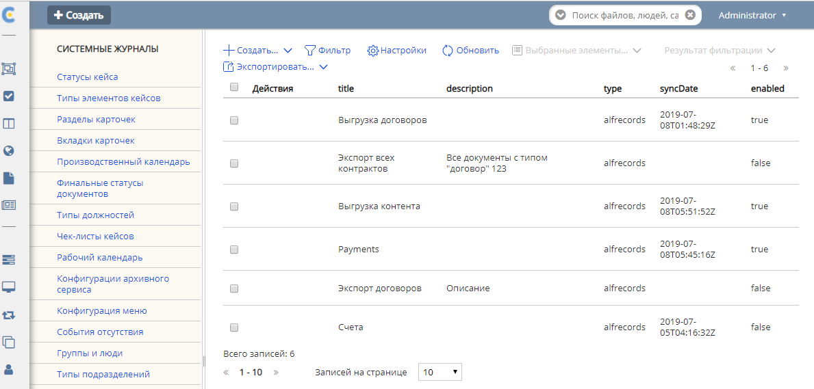
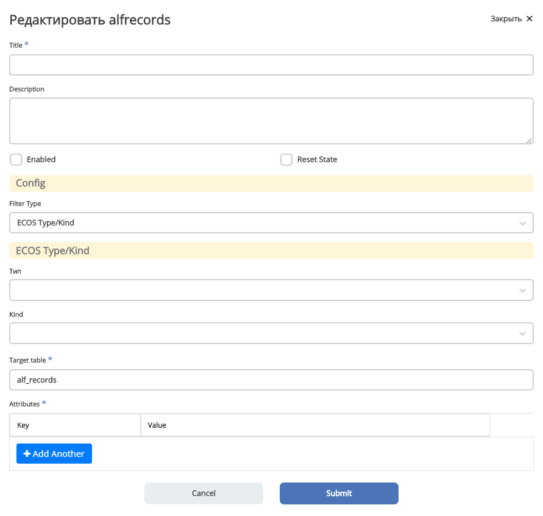

==============
**Интеграции**
==============

EDI
---

Основные принципы
~~~~~~~~~~~~~~~~~

Интеграция с ЭДО провайдерами, как уже писалось в других статьях на эту тему, построена на стандартном для микросервиса интеграций механизме - синхронизациях :ref:`ECOS Synchronization <ecos-Synchronization>`. Это для нас означает, что у нас есть простой способ управлять состоянием интеграции с конкретным ЭДО провайдером в рамках настроенного ящика в ECOS посредством уже готового функционала (включение/выключение чекбоксами, сброс состояния при необходимости для старта интеграции с самого начала и тд).

Перейдем к описанию самого функционала с указанием классов.

ECOS синхронизации работают на механизме объявления реализации SyncExecutionFactory, которые поставляют реализации SyncExecution, в котором уже происходит шедулинг интеграции.

В нашем случае, за это ответственны классы EdiSyncExecutionFactory и EdiSyncExecution. Работу EdiSyncExecutionFactory рассматривать не будем, так как кроме регистрации в SyncService и создания EdiSyncExecution - никакой работы он и не делает.

Рассмотрим работу EdiSyncExecution:

* Зашедулить джобу по настройкам.
* В джобе - повесить лок с помощью ShedLock. Если смог повесить лок - работа продолжается.
* Собирает данные для интеграции, ищет зарегистрированную для ЭДО-провайдера из настроек ящика реализацию интерфейса EdiEventsSyncService. Если не находит - сыпет исключения. Важно отметить, что реализаций EdiEventsSyncService в самом микросервисе integrations на самом деле нет, как они подключаются будет описано в разделе ниже.
* Делегирует работу найденному EdiEventsSyncService, передавая ему собранные ранее данные + метод-колбек для обновления состояния синхронизации.

То есть, по факту, особой работы EdiSyncExecution не делает, полезная работа выполняется за счет делегирования.

Связь сервисов-реализации с EdiSyncExecution для интеграции
~~~~~~~~~~~~~~~~~~~~~~~~~~~~~~~~~~~~~~~~~~~~~~~~~~~~~~~~~~~
Ответ довольно прост, существует общая либа *ecos-edi-commons*, в которую вынесены основные интерфейсы интеграции и структуры данных. Таким образом, удается связать решение на уровне интерфейсов (то есть, связь такая, что интерфейс используется в микросервисе integrations, а реализация идет в сторонних либах).

Ок, с этим разобрались, что-то реализуется, а как микросервис то получит это, если он этих зависимостей даже не имеет? Тут ответ уже сложнее. Решение основано на загрузке кода библиотек в микросервис в виде OSGi бандлов. Для более подробного изучения этого - можно почитать статью Функционал загрузки `OSGI пакетов <https://https://www.google.com/>`_ (и рекомендованные статьи), а так же пример загрузки либы контур для этих целей - `Настройка получения событий с ящиком Контур_Диадок <https://https://www.google.com/>`_ 

Рассмотрим что именно за интерфейсы и сервисы определены в ecos-edi-commons либе:

* EdiEventsSyncService - интерфейс, в который делегируется вся интеграция с ЭДО-провайдером.
* EdiEventsSyncServiceResolver - класс, в котором регистрируются EdiEventsSyncService по связке “ЭДО-провайдер - Сервис” при загрузке бандла, предназначенного для интеграции с каким-то ЭДО-провайдером. Содержится в микросервисе в виде бина.
* EdiBoxService - интерфейс для получения информации о ящике. Расширяется в основном коде микросервиса в виде бина.
* EdiApiService - интерфейс для общения с ЭДО провайдером. Содержит методы для всех операций с ЭДО (или почти все).
* EdiApiServiceResolver - класс, в котором регистрируются EdiApiService по связке “ЭДО-провайдер - Сервис” при загрузке бандла, предназначенного для интеграции с каким-то ЭДО-провайдером. Содержится в микросервисе в виде бина.
* EdiService - Класс, который содержит те же методы, что и в EdiApiService, за исключением того, что в каждый метод дополнительно передается параметр EdiProviderType. По сути, является композитным EdiApiService. Делегирует логику в конкретный EdiApiService, полученный по связке с EdiProviderType из EdiApiServiceResolver.
* EdiGenerator + дочерние интерфейсы - интерфейсы для расширения возможностей генерации контента в ЭДО провайдерах. К примеру, может быть 2 реализации генерации печатной формы: через вызов API генерации ПФ в сервисах диадока (удаленная генерация) или генерация силами ECOS (локальная). Регистрируется в EdiGeneratorResolver.
* EdiGeneratorResolver - класс для регистрации EdiGenerator реализаций по составному ключу “Эдо-провайдер+Тип-генератора+вид-генератора”, где Эдо-провайдер - Контур или Корус, Тип генератора - Генерация печатной формы или Генерация титула покупателя, Вид генератора - Произвольная строка с символизирующая вид. Обычно, что то вроде “локальная генерация” или “генерация по API”.
* EdiStateService - Сервис для отправки событий на обработку после получения и первичной обработки их в либе (будет рассмотрено ниже).
  
Примерное взаимодействие сервисов можно изучить подробнее на `drawIO <https://app.diagrams.net/>`_ диаграмме:

`edi_services <https://docs.google.com/document/d/1OPjXLsTkOio4ikiG_a2d7aas_0W6fUrIbDGyNKA2uyY/edit?usp=sharing>`_

Что происходит в либах обработки и что за зверь - EdiStateService
~~~~~~~~~~~~~~~~~~~~~~~~~~~~~~~~~~~~~~~~~~~~~~~~~~~~~~~~~~~~~~~~~
Либы не обрабатывают события. Они их получают исходя последнего обработанного события (хранящегося в состоянии синхронизации), составляют универсальную структуру Event, хранящуюся в либе *ecos-edi-commons* и после этого отправляет эту структуру в EdiStateService.

Структуры в *ecos-edi-commons* можно посмотреть в следующей диаграмме `drawIO <https://app.diagrams.net/>`_ :

`edi_structures <https://docs.google.com/document/d/1zWTdASmNCthb7vuQkwz1ocGGUTYzKlldM1hXl1JdALQ/edit?usp=sharing>`_

EdiStateService - это класс в ecos-edi-commons, который отправляет события по определенному endpoint внутри camel контекста. CamelContext отправителя и CamelContext получателя события - это, как правило, разные контексты. Подобная передача осуществляется использованием эндпоинта direct-vm типа, а не простого direct.

Таким образом, происходит следующее взаимодействие:

.. image:: _static/integration_EDI_1.png
       :scale: 100 %
       :align: center  

, где указано по шагам:

1 - Отправляется запрос выполнить интеграцию через Контур (или иной другой вариант ЭДО-провайдера), для какого-то ящика, от такого то события (вызов EdiEventsSyncService).

2 - В случае найденных событий - трансформирует их в структуру Event и через EdiStateService отправляет сообщение в Camel из контекста Camel микросервиса интеграций.

3 - Camel контекст микросервиса интеграций отправляет сообщение с Event в CamelContext внутри VM, в котором зарегистрирован указанный эндпоинт. На скриншоте указано, что мы используем еще какой-то customer-lib со своим camel контекстом, но такая кастомизация нужна не всегда, в общем случае - будет использоваться сразу переход в ecos-lib.

4 - После выполнения каких-то работа в customer-lib роутах - они отправляют сообщение в CamelContext либы ecos-lib. Там происходит обновление документов, подписей и тд в альфреско путем вызовов Records API.

Стоит уточнить еще раз, customer-lib и ecos-lib - отдельные OSGi бандлы, включенные в микросервис после его старта, которые создают и стартуют Camel контекст, на роутах которого возложена связь между ними. Обязательно нужно соблюдать контракт по именованию endpoint. 

Структура Event
~~~~~~~~~~~~~~~

Не совсем так. Нет, я не имею ввиду, что Event - это какая-то хитрая структура. Это обычный POJO, с сеттерами, геттерами, equals и тд.
Однако, заполнение Event носит определенный характер. Внутри него ДОЛЖНЫ содержаться все документы, состояния которых изменены в рамках данного события.
Это означает, что если обрабатываем событие “Документ подписан”, то это означает, что должна прийти не просто подпись, а еще и информация о документе с АКТУАЛЬНЫМ статусом.
Другая ситуация, если по документу типа УПД пришла корректировка УКД - это означает, что в рамках этого события придет не только УКД, но и информация о текущем новом состоянии УПД (только статус).
Неизменившиеся поля, вроде контента или основанных на контенте формализованных атрибутах, которые могут быть тяжелыми при транспортировании - опускаются.

<<<<<<< HEAD
.. _ecos-Records:

ECOS Records
---------------

ECOS Records - библиотека, которая располагается в репозитории ecos-records и обеспечивает универсальный API для доступа к записям из произвольных источников (БД, alfresco, REST и др.)

**Заметка:** Для работы в IntelliJ IDEA требуется установить в IDEA плагин Lombok.

**Важный момент:** ECOS Records API - это **НЕ GraphQL в чистом виде**. Часть запроса парсится GraphQL, но далеко не весь. В примере ниже показаны GraphQL части:

.. image:: _static/integration_records_1.png
       :scale: 100 %
       :align: center  

Такой запрос аттрибутов преобразуется примерно в следующий вид::

 {
  meta {
    a: att(n: "icase:caseStatusAssoc") {
      disp
    }
    b: att(n: "icase:caseStatusAssoc") {
      disp
    }
    c: att(n: "icase:caseStatusAssoc") {
      disp
    }
    d: att(n: "cm:title") {
      disp
    }
    e: att(n: "cm:title") {
      disp
    }
    f: att(n: "cm:title") {
      disp
    }
    g: att(n: "contracts:contractor") {
      disp
    }
    h: att(n: "contracts:contractor") {
      disp
    }
    i: att(n: "contracts:contractor") {
      disp
    }
    j: edge(n: "contracts:contractWith") {
      options {
        value: str
        label: disp
      }
    }
    k: edge(n: "contracts:contractWith") {
      options {
        label: disp
        value: str
      }
    }
    l: edge(n: "cm:name") {
      multiple
    }
    m: edge(n: "cm:name") {
      multiple
    }
  }
 }

В целях экономии трафика и всвязи со строгими ограничениями на возможные имена возвращаемых полей в запросе подставляются кодовые имена a,b,c,d и тд. После получения данных имена обратно преобразуются в "contractor0", "title0" и т.д

Представленный GraphQL запрос является деталью реализации и может потерять свою актуальность ввиду внутренних изменений (вплоть до замены GraphQL на собственный формат).

RecordsService
~~~~~~~~~~~~~~

Сервис для работы с абстрактными записями, источником которых может быть любой DAO.

Существует четыре операции, которые можно проделывать над записями:

**а) Поиск записей**

Методы: queryRecords

Для поиска записей всегда передается RecordsQuery, который содержит параметры поиска (аналогично SearchParameters из Alfresco). Помимо самого простого метода для поиска с одним параметром RecordsQuery так же есть варианты с объединенным поиском и запросом метаданных. О вариантах запроса метаданных см. ниже.

**б) Получение метаданных записи** (в данном контексте метаданные - любые данные о записи. Например - имя договора, статус или даже контент)

Методы: getAttributes, getAttribute, getMeta

Существует три уровня абстрации для получения метаданных:

DTO Class > Attributes > Schema

* DTO Class - класс, который используется для генерации списка аттрибутов для формирования схемы и запроса метаданных из DAO.

После получения всех данных из DAO идет создание инстансов переданного DTO класса и наполнение его данными с помощью библиотеки jackson;
Список аттрибутов формируется либо из названий полей, либо можно добавить аннотацию MetaAtt для указания аттрибута вручную.

* Attributes - аттрибуты записи. Существует две нотации: упрощенная (перед запросом преобразуется в полную) и полная (дает полный контроль над загружаемыми данными). Сервер отличает вид нотации по первому символу в аттрибуте. Для полной нотации - это "."

*Упрощенная нотация:*

Просто аттрибут - 'cm:title' преобразуется в '.att(n:"cm:title"){disp}'
Аттрибут с типом - 'cm:title?json' преобразуется в '.att(n:"cm:title"){json}'
Метаданные аттрибута - '#cm:title?protected' преобразуется в '.edge(n:"cm:title"){protected}'
Варианты выбора - '#cm:title?options' преобразуется в '.edge(n:"cm:title"){options{label:disp,value:str}}'

Запрос вложенных полей - 'icase:caseStatusAssoc{ .disp, .str, title: cm:title, name: cm:name, uuid: sys:node-uuid}'

преобразуется в '.att(n:"icase:caseStatusAssoc"){_disp:disp,_str:str,title:att(n:"cm:title"){disp},name:att(n:"cm:name"){disp},uuid:att(n:"sys:node-uuid"){disp}}'

*Полная нотация:*

Существует две основных сущности, с которыми идет работа в полной нотации: MetaValue и MetaEdge (интерфейсы из ecos-records).

Запись представлена в виде MetaValue, у которого можно запросить:
* Вложенные аттрибуты (тоже MetaValue) через 'att(n:"Имя_аттрибута"){...}'
* Метаданные аттрибута (MetaEdge) через 'edge(n:"Имя_аттрибута"){...}'
* Скаляр (финальное значение MetaValue, у которого уже нельзя получать вложенные поля) - str, disp, bool и др.

Для получения массива значений следует использовать окончание 's': atts(n:"cm:title"){str} или edge(n:"cm:title"){vals{str}}

Запрос аттрибутов может иметь неограниченную вложенность. Например для получения имени статуса кейса можно запросить следующий аттрибут:
'.att(n:"icase:caseStatusAssoc"){att(n:"cm:title"){str}}'

**ВАЖНО:** Значения аттрибутов перед тем как вернуться проходят процесс упрощения - все json объекты с одним ключом будут развернуты. Например:

Запрос: '.att(n:"icase:caseStatusAssoc"){att(n:"cm:title"){str}}'
DAO по правилам GraphQL вернет следующий ответ: {"att":{"att":{"str":"Новый"}}}
Но сервис убирает лишнюю вложенность и мы получаем просто "Новый"

Запрос: '.att(n:"icase:caseStatusAssoc"){att(n:"cm:title"){str, id}}'
GraphQL: {"att":{"att":{"str":"Новый", "id":"workspace://SpacesStore/satus-new"}}}
Упрощение: {"str":"Новый", "id":"workspace://SpacesStore/satus-new"}

В аттрибуте мы можем так же указывать псевдоним для возвращаемого значения. Например:
Запрос: '.att(n:"icase:caseStatusAssoc"){att(n:"cm:title"){statusName: str, statusId: id}}'
Вернет: {"statusName":"Новый", "statusId":"workspace://SpacesStore/satus-new"}

Для получения аттрибутов есть методы с аргументом Map и Collection.
Если передан Map, то ключи - это псевдонимы для возвращаемых значений. Они могут быть любыми и сервис их никак особым образом не обрабатывает. Значения - запрашиваемые аттрибуты.
Если передана Collection, то это аналогично поведению с Map где каждый ключ равен связанному значению.

* Schema - самый низкоуровневый способ описания метаданных, которые мы хотим получить. Здесь мы передаем GraphQL схему и получаем ответ полностью в том виде, в котором мы его запросили. Данный метод предназначен скорее для системных нужд (например - удаленный вызов getMeta со схемой).

**в) Мутация (изменение или создание) записи;**

Каждый DAO решает сам создавать или редактировать полученную запись. Например: запись где id == "" можно воспринимать как новую и создать её с полученными свойствами.
AlfDictionaryRecords считает каждую запись новой и делегирует создание в AlfNodesRecordsDAO.

**г) Удаление записи;**

RecordRef
~~~~~~~~~~~~
RecordRef - это идентификатор записи, который состоит из трех частей:

а) appname - идентификатор приложения, к которому относится запись.
б) sourceId - идентификатор источника данных, к которому относится запись;
в) id - локальный идентификатор, который должен быть уникален в пределах источника;

Общий вид: "appname/sourceId@id". / и @ - особые разделители. Экранирование пока не поддерживается, но в перспективе "\@" и "\/" не будут считаться спец символами.

* В id может быть закодирован вложенный источник. Например, если мы используем RemoteRecordsDAO и хотим работать с определенным источником на удаленном приложении мы можем составить RecordRef следующим образом: remote-dao-id@dao-on-remote@local-id. В таком случае при попадании RecordRef в RemoteRecordsDAO первый идентификатор источника вырезается и на удаленный сервер отправляется запрос с RecordRef dao-on-remote@local-id

* Если в RecordRef не задан sourceId, то источником по-умолчанию считается - "" (пустая строка). В Alfresco с таким идентификатором зарегистрирован AlfNodesRecordsDAO - источник данных, у которого запись === нода Alfresco. Из этого следует, что NodeRef.toString() === RecordRef.toString() для нод Alfresco;

* "@@localId" === "@localId" === "localId" И "source@@" === "source@"

GraphQL схема
~~~~~~~~~~~~~
::

 type MetaValue {
  id: ID 
  att(n: String): MetaValue
  atts(n: String): [MetaValue]
  bool: Boolean
  disp: String
  edge(n: String): MetaEdge
  has(n: String): Boolean
  json: JsonNode
  num: Float
  str: String
 }

 type MetaEdge {
  description: String
  distinct: [MetaValue]
  editorKey: String
  javaClass: String
  multiple: Boolean
  name: String
  options: [MetaValue]
  protected: Boolean
  title: String
  type: String
  val: MetaValue
  vals: [MetaValue]
 }

 type Query {
  meta: [MetaValue]
 }

.. image:: _static/integration_records_2.png
       :scale: 100 %
       :align: center  

Использование в браузере
~~~~~~~~~~~~~~~~~~~~~~~~
Для работы с RecordsService'ом создан компонент Citeck.Records. Пример использования::

 Citeck.Records.get("workspace://SpacesStore/16d8668d-7325-49ef-80d3-f2bfdb4c6d00").load({
   'status': '.att(n:"icase:caseStatusAssoc"){att(n:"cm:title"){str}}',
   'display': '.disp'
 }).then(res => console.log(res));
 
 Citeck.Records.get('ecos-config@ecos-forms-enable').loadAttribute('.str').then(res => console.log(res))

Использование в журналах
~~~~~~~~~~~~~~~~~~~~~~~~

Для использования RecordsDAO (records source) в журналах надо его описать и зарегистрировать в сервисе (recordsService.register(...)). После указанных действий мы можем прописать в конфиге журнала параметр datasource, в котором указать Id нового RecordsDAO. Пример::

     <bean id="testRecordsConn" class="ru.citeck.ecos.remote.RestConnection">
        <property name="password" value="admin" />
        <property name="username" value="admin" />
        <property name="host" value="http://localhost:8081" />
        <property name="enabled" value="true" />
    </bean>    

    <bean id="taxDocsSourceId81" class="ru.citeck.ecos.records.source.RemoteRecordsDAO">
        <property name="id" value="taxDocsRemote" />
        <property name="enabled" value="true" />
        <property name="restConnection" ref="testRecordsConn" />
        <property name="remoteSourceId" value="tax-docs" />
    </bean>

    <util:list id="tax-documents-sources">
        <ref bean="taxDocsRecordsSource" />
        <ref bean="taxDocsSourceId81" />
    </util:list>

    <bean id="ecos.tax-reporting.tax-docs-records-source" class="ru.citeck.ecos.services.tax.records.TaxDocsRecordsProxy">
        <property name="id" value="tax-docs-proxy" />
        <property name="target">
            <bean class="ru.citeck.ecos.records.source.MultiRecordsDAO">
                <property name="recordsDao" ref="tax-documents-sources" />
            </bean>
        </property>
    </bean>

Схематично доступ к данным в журналах на момент написания статьи выглядит следующим образом:

.. image:: _static/integration_records_2.jpg
       :scale: 100 %
       :align: center  

Выполнение групповых действий
~~~~~~~~~~~~~~~~~~~~~~~~~~~~~

Выполнение группового действия делегируется RecordsDAO, к которому относится запись (определяется по sourceId). Имплементация может отправлять удаленные запросы или выполнять действия локально. Для работы с данными, которые приходят и локально и удаленно можно использовать RecordsActionFactory. Для примера можно посмотреть AddDocumentToTaxPackageAction, DeleteTaxDocumentAction, ExportTaxDocuments, ExportTaxInventory в ecos-enterprise

Известные проблемы:

Если RecordsDAO возвращает записи с Server ID отличным от пустой строки, то в журналах не будут отображаться действия для этих записей.
Решение: Использовать actionFormatter для описания экшенов.
Ссылка:
:ref:`Конфигурация журналов <ecos-journals_config>`
Раздел: Переопределение действий для записей (actionFormatter).
=======
>>>>>>> 94a11f9afd8f43ef4bbac19de108ea68b58a8a86
Currency rates
--------------

Message queue
-------------

.. _ecos-Synchronization:

ECOS Synchronization
--------------------
В микросервисе ecos-integrations добавлена поддержка выгрузки нод альфреско в таблицу базы данных. На данный момент выгрузка осуществляется в таблицы БД микросервиса ecos-integrations.

Команда для подключения к БД на стенде с контейнерами докера::

 /usr/bin/psql postgres://integrations@localhost:15432/integrations

Параметры для подключения к alfresco по REST::

 ecos-integrations:
    alfresco:
        url: http://ecos:8080
        authentication:
            username: integrations
            password: 97qiow104UIG

Можно менять эти настройки на стендах или оставить как есть (будет работать только если ECOS развернут в той же докер сети под именем "ecos").

На стороне alfresco для микросервиса должна быть заведена учетная запись integrations с паролем 97qiow104UIG (значения по-умолчанию) и админскими правами.

Скрипт для создания пользователя::

 var userName = "integrations";
 people.createPerson(userName, userName, userName, userName + "@ecos.ru", "97qiow104UIG", true);
 var adminsGroup = groups.getGroup("ALFRESCO_ADMINISTRATORS");
 adminsGroup.addAuthority(userName);

Чтобы настроить выгрузку нод необходимо на стенде с ecos-enterprise-repo модулем открыть системные журналы в alfresco и найти там журнал Синхронизация (Synchronization):

* title - заголовок синхронизации
* description - описание синхронизации
* type - тип синхронизации (пока доступен только 1 тип - alfrescords (выгрузка нод альфреско))
* enabled - включена или нет синхронизация

В журнале можно создать новую выгрузку двумя способами:

1) Создание с помощью полей формы (удобно для создания "с нуля")
2) Создание с вводом json (удобно для переноса конфигурации между серверами)

.. image:: _static/integration_synchronization_2.png
       :scale: 100 %
       :align: center  

Создание с помощью формы выглядит следующим образом:

* Title - Заголовок выгрузки. Нужен для отображения в журнале синхронизации
* Description - Описание выгрузки. Следует заполнить это поле чтобы другие люди могли сразу понять предназначение выгрузки.
* Enabled - Включить/выключить синхронизацию;
* Reset state - Сбросить состояние (выгрузка начнется с самого начала)
* Config - Раздел с конфигурацией выгрузки
* Filter type - Тип фильтра, по которому будут выбираться ноды для выгрузки. На момент написания статьи доступно два типа:
	* **ECOS Type/Kind** - фильтрация происходит по выбраному типу и виду
	* **Raw Predicate** - фильтрация происходит по заданному предикату в формате JSON. Синтаксис предикатов можно посмотреть здесь Select Journal
* Target table - Имя таблицы для выгрузки. В базе данных к этому имени прибавится префикс **ecos_sync_** чтобы исключить случайные изменения системных таблиц.
* Attributes - Выгружаемые аттрибуты. Слева описываются названия колонок в результирующей таблице, а справа выгружаемые аттрибуты. Синтаксис аттрибутов в правой колонке используется из Records API. Т.о. можно выгружать вложенные аттрибуты. Например для выгрузки статуса договора можно описать следующие аттрибуты::

  {
	"status_id": "icase:caseStatusAssoc?id", //нодреф статуса
	"status_ru": "icase:caseStatusAssoc.cm:title.ru", //заголовок статуса на русском
	"status_en": "icase:caseStatusAssoc.cm:title.en" //заголовок статуса на английском
  }

Если у аттрибута опустить тип скаляра (после знака ?), то по-умолчанию все аттрибуты будут выгружаться в строковом виде. Если требуется числовой вид, то следует добавить к аттрибуту **?num**, а для булева поля **?bool**.

Для полей с датой на данный момент есть возможность их выгрузить в виде строки с форматом ISO8601 (это происходит автоматически и дополнительной настройки для этого не нужно).

Подробнее о синтаксисе аттрибутов можно почитать в соответствующей статье: :ref:`ECOS Records <ecos-Records>`

Изменение синхронизации "на лету"
~~~~~~~~~~~~~~~~~~~~~~~~~~~~~~~~~
Настройку синхронизации можно менять без перезагрузки сервера. При этом есть несколько особенностей:

1) Новые аттрибуты будут появляться только для заявок, которые изменились с момента изменения конфигурации. Для того чтобы новые аттрибуты появились у всех записей можно воспользоваться двумя способами:

Первый - сбрасываем состояние синхронизации и недостающие данные синхронизируются полностью.

Второй - создаем новую конфигурацию с недостающими атрибутами(которые были добавлены в исходную конфигурацию) и устанавливаем в ней ту же таблицу что и в исходной конфигурации. Когда новая конфигурации догонит старую, новую можно будет удалить.

2) При удалении аттрибутов таблица не чистится. То что уже синзронизировано остается в таблице.

3) Изменение типа колонки на данный момент не поддерживается. Т.о. следует создать новый аттрибут если есть такая необходимость, а старый удалить из конфигурации. Для миграции старых записей можно воспользоваться рекоментациями из п.1

Перенос конфигурации между стендами
~~~~~~~~~~~~~~~~~~~~~~~~~~~~~~~~~~~

Затем нужно:

1) Скопировать содержимое этого файла
2) перейти на целевой стенд
3) открыть журнал синхронизации
4) Нажать Создать → Import JSON
5) В появившемся окне вставить json, который мы скопировали в п.1
6) Сохранить форму
7) Обновить содержимое журнала

.. image:: _static/integration_synchronization_5.png
       :scale: 100 %
       :align: center  

Структура таблицы с данными
~~~~~~~~~~~~~~~~~~~~~~~~~~~
**id** (SERIAL PRIMARY KEY) - идентификатор строки,
**_modified** (TIMESTAMPTZ) - дата последнего изменения строки,
**_created** (TIMESTAMPTZ) - дата создания строки,
**_version** (BIGINT) - внутренняя версия записи. Используется, чтобы избежать одновременного изменения из раных потоков или инстансов микросервиса.
**modified** (VARCHAR) - дата изменения, записи в alfresco в ISO8601,
**record_ref** (VARCHAR) - alfresco@ + nodeRef заявки в alfresco

- все поля, которые описаны в интерфейсе
  
Пример скрипта для просмотра существующих записей в alfresco, для просмотра данных которые пойдут в таблицу интеграции
~~~~~~~~~~~~~~~~~~~~~~~~~~~~~~~~~~~~~~~~~~~~~~~~~~~~~~~~~~~~~~~~~~~~~~~~~~~~~~~~~~~~~~~~~~~~~~~~~~~~~~~~~~~~~~~~~~~~~~~
Часть с атрибутами можно взять из json конфигурации интеграции, поле "attributes"::

	Citeck.Records.query({
	query: 'tk:type:"workspace://SpacesStore/type-unilever-te-request"',
	language: 'fts-alfresco',
	consistency: 'EVENTUAL',
	page: {
	maxItems: 100
	}
	}, {
	"Reg Number": "uterm:terRegNumber",
	"Expense Type": "uterm:terExpenseType.utedm:teetName",
	"RP": "uterm:reportablePerson",
	"RP Cost Center ": "uterm:terRPCostCenter",
	"OS GRC Code": "uterm:terOrdSignCRGCode.cm:title",
	"RP Vendor Code": "uterm:terRPVendorCode",
	"RP ID": "uterm:terRPPersonnelNumber",
	"RP Sub Function": "uterm:terRPSubFunction.udm:subFunctionName",
	"AR Approve Date": "uterm:terAdvRepApproveDate",
	"OS Date": "uterm:terOrdSignDate",
	"Status": "icase:caseStatusAssoc.cm:title",
	"Line Manager": "uterm:terLineManager",
	"Accountant": "uterm:terAccountant",
	"OS Goal Travel": "uterm:terOrdSignGoalTravelType.cm:title",
	"OS Outsider Goal Travel": "uterm:terOrdSignOutsiderGoalTravelType.cm:title",
	"OS Travel Begin Date": "uterm:terOrdSignTravelBeginDate",
	"OS Travel End Date": "uterm:terOrdSignTravelEndDate",
	"OS Destination City": "uterm:terOrdSignDestinationCity",
	"OS Diff Destination Point": "uterm:terOrdSignDiffDestinationPoint",
	"OS Hotel Required": "uterm:terOrdSignHotelRequired.cm:title",
	"OS Ticket Required": "uterm:terOrdSignTicketRequired",
	"OS Tickets": "uterm:terOrdSignTicketsTable.uterm:tertTransportType",
	"AR Doc Requester Amount": "uterm:terAdvRepDocRequesterAmount",
	"AR Currency": "uterm:terAdvRepCurrency.idocs:currencyName"
	}).then(console.log);

"Reg Number" - key (Attributes),
"uterm:terRegNumber" - value (Attributes)

Восстановление потеряных записей
~~~~~~~~~~~~~~~~~~~~~~~~~~~~~~~~

Версия микросервиса: 1.14.0-snapshot

На форму добавлен флаг “Run recovery job”. Если он активен, то вместе с основной выгрузкой дополнительно запускается джоба, которая ищет пропущенные записи за последний час. Если такие записи находятся, то происходит запуск восстановления. В процессе восстановления сужается диапазон дат, между которыми найдено отличие. После уменьшения диапазона происходит пересинхронизация найденых в нем записией.

.. important:: значение флага проверяется только при запуске выгрузки (флаг Enabled переключается с False на True) или при перезагрузке микросервиса.

Дата модификации записи сохраняется в поле _rec_modified. Возможно потребуется создание индексов для этого поля, чтобы джоба работала эффективнее (Но все же если поиск будет долгим, то ничего страшного не произойдет. Просто восстановление будет происходить не так быстро).