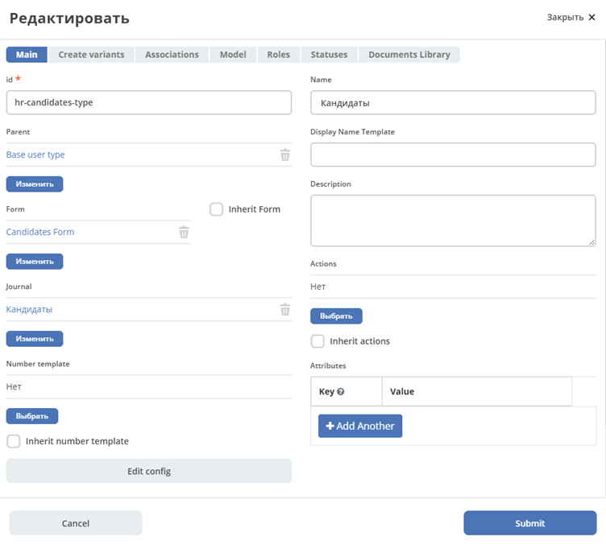
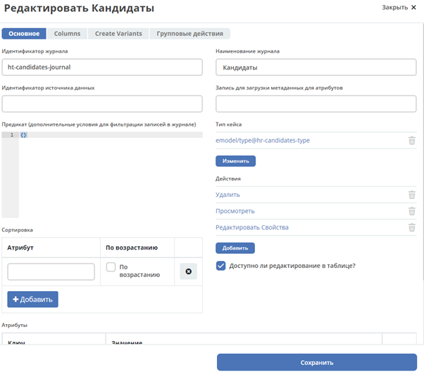
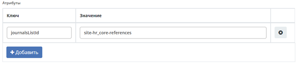
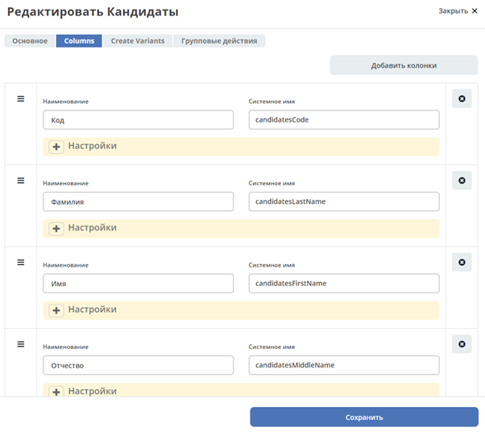
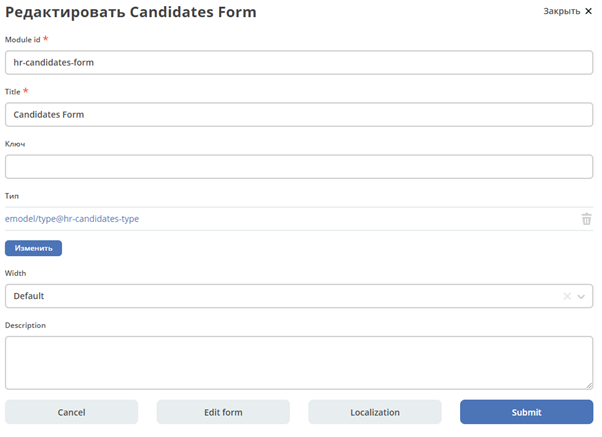
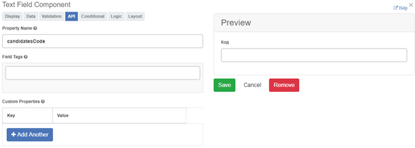
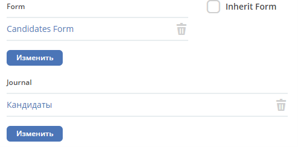
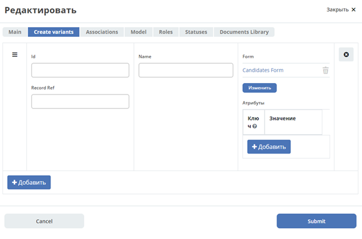

========================
Пример настройки "Оффер"
========================
Создание типа кейса (для справочника)
--------------------------------------

Вкладка Main
~~~~~~~~~~~~
Заполняем поля:
id - уникальный идентификатор типа кейса
Name - любое осмысленное имя
Parent - у всех типов должен быть родитель, по умолчанию базовый тип(или базовый пользовательский типBase user type) 

Переходим во вкладку Model

Вкладка Model
~~~~~~~~~~~~~~

Переходим во вкладку Model. Добавляем здесь атрибуты, которые должны быть у модели(id, name, type)
Type - тип атрибута

После этого переходим к созданию журнала для созданного типа кейса

В поле "тип кейса" выбираем созданный ранее тип кейса. 
В действиях возможно добавить те действия, которые будут доступны в нашем журнале (по умолчанию можно не добавлять никаких действий).

Для добавления нового журнала в список журналов следует в ключе указать **journalsListId**, в значении указать идентификатор нужного листа журналов.

Переходим во вкладку Columns

Вкладка Columns
~~~~~~~~~~~~~~~
Чтобы журнал сохранился нужно указать хотя бы одну колонку.
Далее переходим в системный журнал формы и создаем форму для созданного типа кейса.

В поле *Тип* выбираем тип созданного кейса
Переходим во вкладку API

Вкладка API
~~~~~~~~~~~

В компонентах формы во вкладке API в поле Property Name надо указать имя выбранного атрибута модели/

Далее возвращаемся к созданному типу кейса

Выбираем форму и журнал, созданные под тип кейса
Переходим во вкладку Create variants

Вкладка Create variants
~~~~~~~~~~~~~~~~~~~~~~~
Чтобы тип создавался по определенной форме надо в Form выбрать нужную форму

