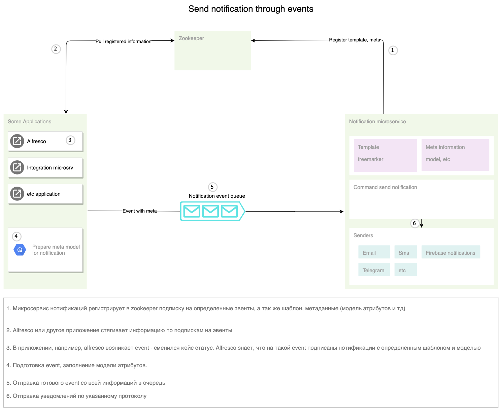

====================
**Уведомления**
====================

Основная настройка
------------------

Template content (Шаблон, тело письма)
~~~~~~~~~~~~~~~~~~~~~~~~~~~~~~~~~~~~~~~

Freemarker
""""""""""

Отправка уведомлений через команду
----------------------------------
Отправка уведомлений через команду. Например команда отправить емейл в flowable, действие в кейс менеджменте.

.. image:: _static/Notification_microserv.png
       :scale: 70 %
       :align: center
       
       
Уведомление через событие
-------------------------
Отправка уведомлений как реакция на событие - сменился кейс статус, изменился атрибут, назначалась задача и т.д.

Архитектура events
~~~~~~~~~~~~~~~~~~~~~~~~~~~~

Обработка events для отправки нотификаций по задачам
~~~~~~~~~~~~~~~~~~~~~~~~~~~~~~~~~~~~~~~~~~~~~~~~~~~~~~~~~~~~~

14.2.3) Условия отправки
~~~~~~~~~~~~~~~~~~~~~~~~