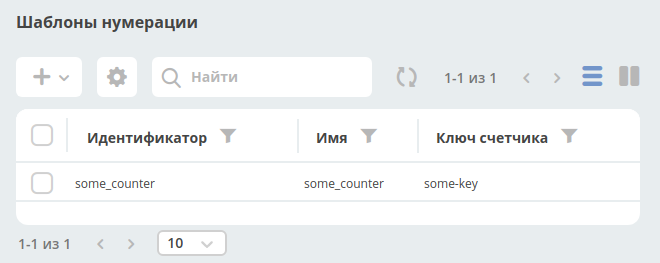

=====================
**Шаблоны нумерации**
=====================

Template
---------------
С релиза 3.20.0 появилась поддержка шаблонов нумерации, которые можно полностью настроить через интерфейс.
Шаблоны и счетчики для них хранятся в ecos-model

.. image:: _static/Number_template_1.png
       :scale: 100 %
       :align: left

.. include:: number-template.graphml

Number template
~~~~~~~~~~~~~~~~
Сущность, которая определяет шаблон счетчика на основе текущей даты или полей в сущности, которую мы хотим пронумеровать.

Поля:
- id - идентификатор сущности
- name - произвольное имя. Справочная информация
- counterKey - шаблон ключа счетчика. Может быть как константой (будет создан только 1 счетчик для шаблона) так и с вставками в формате ${атрибут_из_нумеруемой_сущности}. В будущем будет возможность так же использовать текущую дату для шаблона (например, для старта нумерации с 0 каждый год или месяц или день).

Number counter
~~~~~~~~~~~~~~
Сущность, в которой ведется счет

Поля:
- key - ключ счетчика. Константное значение, которое получилось после вычисления counterKey в шаблоне нумерации
- counter - значение счетчика

Алгоритм работы
---------------

В приложении, которое использует шаблоны нумерации (на данный момент - это alfresco) настраивается синхронизация с загрузкой всех шаблонов из ecos-model с целью получения списка атрибутов, которые нужны шаблону.

При создании новой сущности мы берем её тип, из типа получаем шаблон нумерации и если он задан, то достаем список необходимых для шаблона атрибутов. Далее отправляем команду с необходимыми атрибутами в ecos-model для получения следующего значения счетчика. Получив значение счетчика сохраняем его в одном из полей (в alfresco значение счетчика всегда сохраняется в **ecos:docNum**).

Для получения значения счетчика следует всегда использовать системный атрибут **_docNum** (каждый источник ответственен за возвращение актуального значения нумерации по этому атрибуту).

Настройка шаблона в интерфейсе
------------------------------
a) Открываем системные журналы и переходим в журнал “шаблоны нумерации”

b) Нажимаем + и выбираем “Создать новый шаблон”

c) Вводим Id, name и counterKey и жмем Submit
Новый шаблон создан. Теперь его можно указывать в любом типе кейса:

