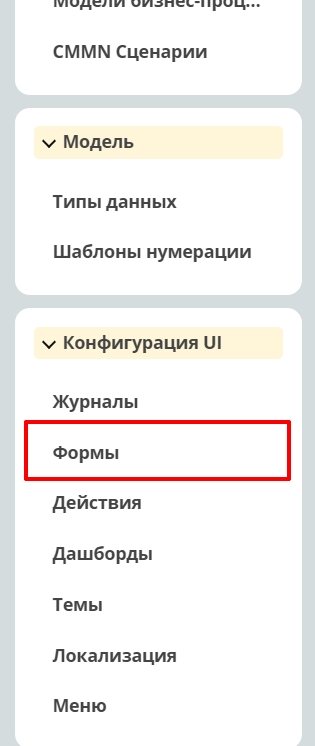
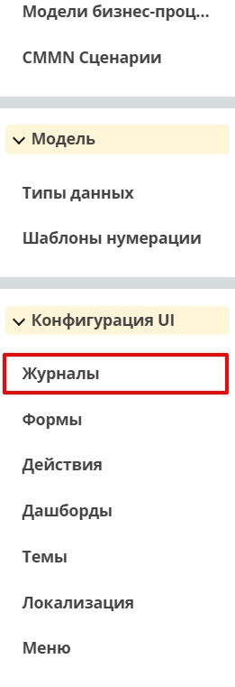
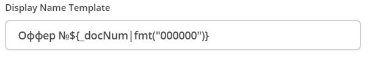
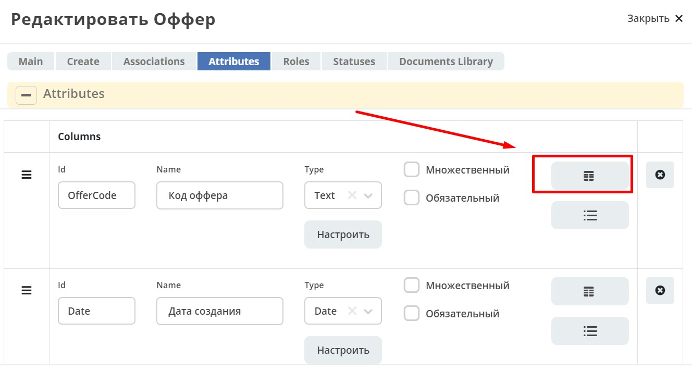
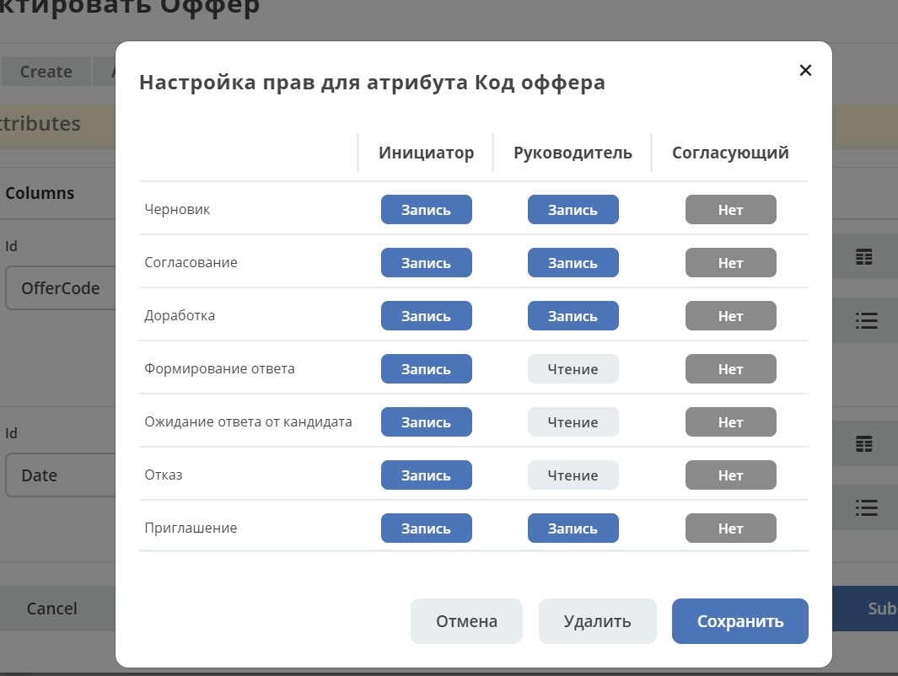
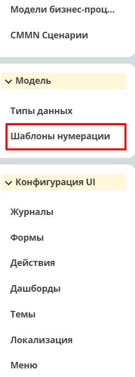
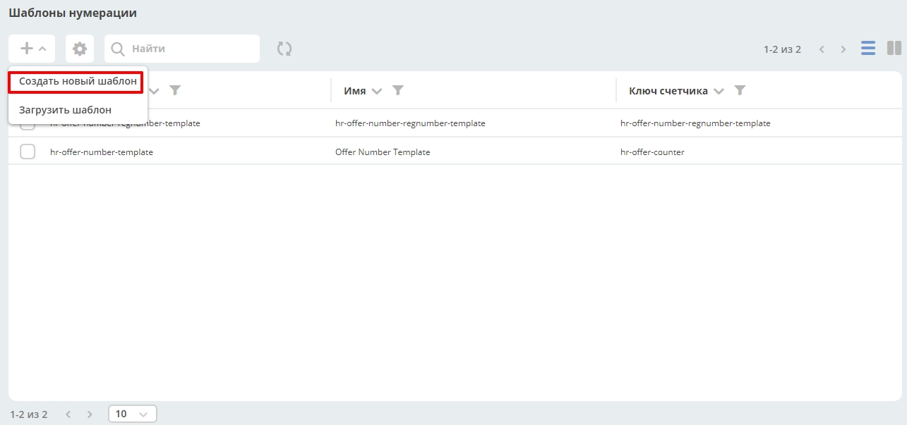
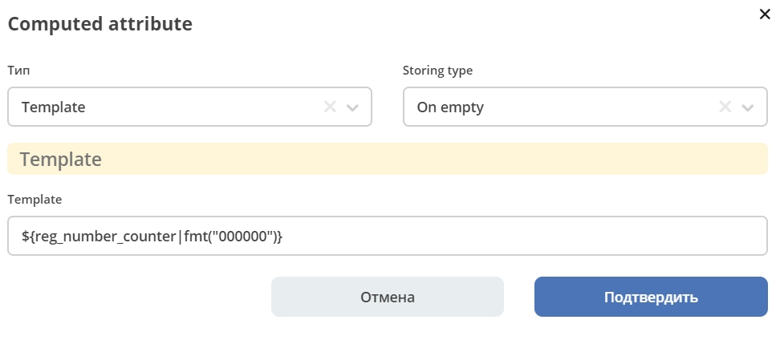

ВВЕДЕНИЕ
=========

В этом разделе размещено руководство, описывающее процесс создания кейса (тип данных ECOS) в системе Citeck ECOS.

Руководство состоит из описания создания справочника "Кандидаты" и кейса "Оффер".

Приведены пошаговые инструкции, создания типового кейса HR отдела по согласованию Офферов. Весь процесс дополнен скриншотами, начиная с процесса создания места хранения информации и прописывания решений,
принимаемых на каждом этапе процесса, до настройки расположения виджетов на рабочей странице (дашборде).

Создание справочника «Кандидаты»
====================================

Создание типа кейса "кейс Кандидаты"
-----------------------------------------

Переходим в инструменты.

.. image:: _static/переход_в_инструменты.jpg
      :align: center
      :alt: Переход в инструменты

Справа сверху нажимаем на кнопку :guilabel:`Показать меню`.

.. image:: _static/Кнопка_показать_меню.jpg
        :align: left
        :alt: Кнопка "Показать меню"

Выбираем :guilabel:`Типы данных`.

.. image:: _static/выбрать_типы_данных.jpg
       :align: center
       :alt: Выбрать тип данных

Слева сверху нажимаем на кнопку создания, выбираем :guilabel:`Создать новый тип`.

.. image:: _static/Кнопка_создать_тип_кейса.jpg
        :align: center
        :alt: Кнопка "Создать тип кейса"

Вкладка Main (id, parent, name, description)
-------------------------------------------------

* **Id** - уникальный идентификатор.
* **Parent** - выбрать *datalist* для справочника или *case* для кейса (карточки бизнес-процесса).
* **Name** - человекопонятное имя.
* **Description** - описание данного типа ECOS (необязательно).

.. image:: _static/Форма_создания_типа_данных.jpg
        :align: center
        :alt: Форма создания типа данных

Работа с моделью (Вкладка Attributes)
--------------------------------------

Заполняем модель атрибутами.
* **Id** - уникальный идентификатор атрибута.
* **Name** - человекопонятное имя атрибута.
* **Type** - подходящий тип атрибута.

.. image:: _static/Атрибуты_модели.png
        :align: center
        :alt: Аттрибуты модели

Создание формы "Кандидаты"
--------------------------

Справа в меню переходим в журнал :guilabel:`Формы`.

Нажимаем на кнопку создания формы.

.. image:: _static/Кнопка_создать_форму.jpg
        :align: center
        :alt: Кнопка "Создать форму"

Основные параметры формы (Module id, Title, Key, Тип)
~~~~~~~~~~~~~~~~~~~~~~~~~~~~~~~~~~~~~~~~~~~~~~~~~~~~~~~~~

* **Module id** - уникальный идентификатор формы.
* **Title** - человекопонятное имя формы.
* **Key** - ключ формы (такой же как и **Module id**).
* **Тип** - из списка выбрать тип кейса, созданный ранее.

.. image:: _static/Параметры_формы.jpg
        :align: center
        :alt: Параметры формы

Form builder
~~~~~~~~~~~~

В колонке слева расположены основные элементы формы. Для добавления элемента его необходимо перетянуть на в выбранное место на форме.

.. image:: _static/form_builder.jpg
        :align: center
        :alt: Form builder

.. _candidates-components:

**Columns** - позволяет удобно расположить компоненты формы.

.. image:: _static/columns_component.jpg
        :align: center
        :alt: Columns component

**Column Properties** - основной параметр настройки, позволяет определить как по колонкам будет разбиваться компонент.

.. image:: _static/columns_properties.jpg
        :align: center
        :alt: Columns conponent2

**Text field** (например "Код") - текстовый компонент.
Заполняется **Label** - человекопонятное имя компонента.

.. image:: _static/code_label.jpg
        :align: center
        :alt: Code and Label

Вкладка **API **- здесь заполняется *Property Name*.
**Property Name** - имя свойства в типе кейса.

.. image:: _static/code_api_candidates_form.jpg
        :align: center
        :alt: API and Property name

ECOS **Select Component** - компонент формы для выбора значения из списка.
Заполняется **Label** - человекопонятное имя компонента.

.. image:: _static/gender_label_candidates.jpg
        :align: center
        :alt: Gender Label

Вкладка :guilabel:`Data` - в **Data Source Type** выбираем *Values*.
**Data Source Values** - заполняется значениями, которые должны быть в списке. (*Label* - отображаемое имя,
*Value* - значение, которое содержится)

.. image:: _static/gender_data_candidates.jpg
        :align: center
        :alt: Gender Data

Вкладка **API** - здесь заполняется *Property Name*.
**Property Name** - имя свойства в типе кейса.

.. image:: _static/gender_api_candidates.jpg
        :align: center
        :alt: Gender API

**Date** / **Time Component** - компонент даты / времени.
Заполняется **Label** - человекопонятное имя компонента.
**Format** - позволяет указать формат даты.

.. image:: _static/date_label_candidates.jpg
        :align: center
        :alt: Date Label

Вкладка **API** - здесь заполняется Property Name.
**Property Name** - имя свойства в типе кейса.

.. image:: _static/date_api_candidates.jpg
        :align: center
        :alt: Date API

**Select Journal Component** - компонент для выбора значения из журнала.

Заполняется **Label**- человекопонятное имя компонента.

.. image:: _static/select_journal_label_candidates.jpg
        :align: center
        :alt: Select Journal Label

Вкладка :guilabel:`Data` - заполняется **Journal ID** - идентификатор журнала, который хотим использовать в компоненте.

.. image:: _static/select_journal_data_candidates.jpg
        :align: center
        :alt: Select Journal Data

Вкладка :guilabel:`API` - здесь заполняется **Property Name**.
**Property Name** - имя свойства в типе кейса.

.. image:: _static/select_journal_api_candidates.jpg
        :align: center
        :alt: Select Journal API

.. _candidates-localization:

Кнопка Localization
~~~~~~~~~~~~~~~~~~~~~~~

.. image:: _static/Кнопка_локализация.jpg
        :align: center
        :alt: Кнопка локализации

Здесь прописывается локализация для компонентов формы.
В параметре **Key** указывается *Label* компонента.

В **Locale** нажимаем кнопку :guilabel:`Add Message`, выбираем необходимый язык, в поле **Message** прописываем то,
что будет отображаться.

.. image:: _static/Локализация.png
        :align: center
        :alt: Локализация

Создание журнала "журнал Кандидаты"
-----------------------------------------

Справа в меню переходим в журнал **Журналы**.

Нажимаем на кнопку создания журнала.

.. image:: _static/Кнопка_создать_журнал.jpg
        :align: center
        :alt: Кнопка "Создать журнал"

Основные параметры журнала (Идентификатор журнала, Наименование журнала, Тип кейса, Действия)
~~~~~~~~~~~~~~~~~~~~~~~~~~~~~~~~~~~~~~~~~~~~~~~~~~~~~~~~~~~~~~~~~~~~~~~~~~~~~~~~~~~~~~~~~~~~~~~~~

* **Идентификатор журнала** - уникальный идентификатор журнала.
* **Наименование журнала** - человекопонятное имя журнала.
* **Тип кейса** - из списка выбрать тип кейса, созданный ранее.
* **Действия** - из списка выбрать действия, которые будут доступны для объектов журнала.

.. image:: _static/Параметры_журнала.jpg
        :align: center
        :alt: Параметры журнала

Вкладка Columns (Обязательный для отображения)
~~~~~~~~~~~~~~~~~~~~~~~~~~~~~~~~~~~~~~~~~~~~~~~~~~~~

Здесь заполняются колонки журнала.

В поле **Наименование** пишем то, как будет называться колонка. **Системное имя** - Id атрибута модели.

.. image:: _static/Вкладка_Columns.png
        :align: center
        :alt: Вкладка Columns

Добавление формы и журнала в тип ECOS
--------------------------------------

Справа в меню переходим в системный журнал **Типы данных**.

.. image:: _static/выбрать_типы_данных.jpg
        :align: center
        :alt: Выбор типа данных

Выбираем ранее созданный тип ECOS :guilabel:`Кандидаты`.

В параметре **Form** выбираем форму, которую создали.
В параметре **Journal** выбираем журнал, который создали.

.. image:: _static/Добавление_журнала_и_формы_в_тип_кейса.jpg
        :align: center
        :alt: Добавление журнала и формы в тип данных

Настройка меню
--------------

Переходим в настройку меню, нажав на шестеренку, потом на кнопку "Настроить меню" справа сверху.

.. image:: _static/Кнопка_настройки_меню.jpg
        :align: left
        :alt: Кнопка "Настройки меню"

Выбираем элемент меню, в котором будет находится справочник "Кандидаты".
Наводим на элемент и нажимаем кнопку "Добавить", выбираем "Журнал", из списка выбираем необходимый журнал.

.. image:: _static/Настройка_меню.jpg
        :align: center
        :alt: Настройка меню

----------------------------------------------------------------------------------------------------------------------------------

Создание типа ECOS «Оффер»
==========================

Тип данных
---------------

Переходим в инструменты.

.. image:: _static/переход_в_инструменты.jpg
        :align: center
        :alt: Переход в инструменты

Справа сверху нажимаем на кнопку "Показать меню".

.. image:: _static/Кнопка_показать_меню.jpg
        :align: left
        :alt: Кнопка "Показать меню"

Выбираем "Типы данных".

.. image:: _static/выбрать_типы_данных.jpg
       :align: center
       :alt: Выбрать тип данных

Слева сверху нажимаем на кнопку создания, выбираем "Создать новый тип".

.. image:: _static/Кнопка_создать_тип_кейса.jpg
        :align: center
        :alt: Кнопка создать тип даных

Вкладка Main (id, parent, name, description, действия)
-------------------------------------------------------

Id - уникальный идентификатор.
Parent - выбрать Case (так как мы создаем кейс/карточку процесса. Если бы мы хотели создать справочник - необходимо было бы выбрать значение datalists)
Name - человекопонятное имя.
Description - описание данного типа ECOS (необязательно).
Действия (необязательно) - из списка выбрать действия, которые будут доступны на карточке кейса.

.. image:: _static/Параметры_типа_кейса_оффер.jpg
        :align: center
        :alt: Параметры типа кейса

Также можно настроить параметр Display Name Template - это титульник созданных объектов, здесь используется
системный атрибут _docNum для получения значения счетчика.

Работа с моделью (Вкладка Attributes)
~~~~~~~~~~~~~~~~~~~~~~~~~~~~~~~~~~~~~~

Заполняем модель атрибутами.
Id - уникальный идентификатор атрибута.
Name - человекопонятное имя атрибута.
Type - подходящий тип атрибута.

.. image:: _static/Атрибуты_модели_оффер.jpg
        :align: center
        :alt: Атрибуты модели Оффер

Роли (Вкладка Roles)
""""""""""""""""""""""

Id - уникальный идентификатор роли.
Name - человекопонятное имя роли.
Assignees - можно выбрать группу пользователей и отдельных пользователей.
Атрибут - атрибут в модели.

.. image:: _static/Роли_оффера.jpg
        :align: center
        :alt: Роли Оффера

Статусы (Вкладка Statuses)
"""""""""""""""""""""""""""

Id - уникальный идентификатор статуса.
Name - человекопонятное имя статуса.

.. image:: _static/Статусы_оффера.png
        :align: center
        :alt: Статусы Оффера

После того как настроили роли и статусы, во вкладке Attributes можно настроить матрицу прав.

        

.. image:: _static/Кнопка_прав_оффер.jpg
        :align: center
        :alt: Кнопка прав Оффер

Шаблоны нумерации
------------------

Выбираем "Шаблоны нумерации".

Слева сверху нажимаем на кнопку создания, выбираем "Создать новый шаблон".

Id - уникальный идентификатор шаблона нумерации.
Name - человекопонятное имя шаблона нумерации.
Key - что написать? (?)

Этот шаблон служит счетчиком для регистрационного номера в модели.

.. image:: _static/regnumber_template.jpg
        :align: center
        :alt: Регистрационный номер

.. image:: _static/offer_number_template.jpg
        :align: center
        :alt: Оффер регистрационный номер

После создания шаблонов нумерации добавим их в тип ECOS.

Выбираем "Типы данных".

.. image:: _static/выбрать_типы_данных.jpg
        :align: center
        :alt: Выбрать типы данных

В параметре "Number template" выбираем шаблон нумерации.

.. image:: _static/Выбрать_шаблон_нумерации_оффер.jpg
        :align: center
        :alt: Выбрать шаблон нумерации Оффер

Во вкладке Model у атрибутов можно вычислить значение.

.. image:: _static/Кнопка_вычислить.jpg
        :align: center
        :alt: Кнопка "Вычислить"

Вычислим значение у атрибута "idocs:registrationNumber".

Здесь мы получаем значение из атрибута reg_number_counter, в который приходит значение из шаблона нумерации,
с помощью fmt("000000") приводим значение к шестизначному виду.

Выбрать нужный тип и заполнить соответствующие параметры (для каждого типа разные параметры).

Вычислим значение у атрибута "reg_number_counter".

.. image:: _static/Вычисление_шаблон_нумерации.jpg
        :align: center
        :alt: Вычисление шаблон нумерации

Создание формы "форма Оффер"
----------------------------

Справа в меню переходим в журнал "Формы".

Нажимаем на кнопку создания формы.

.. image:: _static/Кнопка_создать_форму.jpg
        :align: center
        :alt: Кнопка "Создать форму"

Основные параметры формы (Module id, Title, Key, Тип)
~~~~~~~~~~~~~~~~~~~~~~~~~~~~~~~~~~~~~~~~~~~~~~~~~~~~~~

Module id - уникальный идентификатор формы.
Title - человекопонятное имя формы.
Key - ключ формы (такой же как и Module id).
Тип - из списка выбрать тип данных, созданный ранее.

.. image:: _static/Параметры_формы_оффер.jpg
        :align: center
        :alt: Параметры формы Оффер

Form builder
~~~~~~~~~~~~

Здесь имеются различные компоненты формы.

:ref:`Компоненты формы "Кандидаты"  <candidates-components>`

Panel (например "Регистрация") - находится во вкладке "Layout"

.. image:: _static/component_panel.jpg
        :align: center
        :alt: Компонент Panel

Заполняется "Title" - человекопонятное имя компонента.

.. image:: _static/panel_title.jpg
        :align: center
        :alt: Компонент Title

Select Orgstruct Component (например "idocs:initiator") - компонент для выбора из оргструктуры.
Заполняется "Label" - человекопонятное имя компонента.

.. image:: _static/orgstruct_label.jpg
        :align: center
        :alt: Компонент Label

Вкладка Custom - можно указать допустимый тип "Allowed authority type",
Current user by default - настройка, позволяющая подставить в компонент пользователя, который открыл форму на создание.

.. image:: _static/orgstruct_custom.jpg
        :align: center
        :alt: Вкладка Custom

Вкладка API - здесь заполняется Property Name.
Property Name - имя свойства в типе ECOS.

.. image:: _static/orgstruct_api.jpg
        :align: center
        :alt: Оргструкт API

Async Data Component - асинхронный компонент.

.. image:: _static/asyncdata_component.jpg
        :align: center
        :alt: Компонент Asyncdata

Заполняется "Label" - человекопонятное имя компонента.
Data type - тип данных.

.. image:: _static/asyncdata_example.jpg
        :align: center
        :alt: Пример asyncdata

Пояснения к скрипту.

.. image:: _static/asyncdata_script.jpg
        :align: center
        :alt: Скрипт asyncdata

emodel/type@hr-grades-type - тип, из которого хотим получить какие либо данные.
gradesSimpleRoleTypeAssoc - сравниваемое свойство типа, из которого получаем данные.
offerPosition - свойство, которое используем для сравнения со свойством типа, из которого получаем данные.

Здесь указываем атрибут, который хотим получить.

.. image:: _static/asyncdata_attributes.jpg
        :align: center
        :alt: атрибуты asyncdata

Вкладка Advanced.
Refresh on - данный параметр имеет поле для указания элементов формы, которые следует отслеживать.

.. image:: _static/asyncdata_advanced.jpg
        :align: center
        :alt: Вкладка Advanced

Вкладка API - здесь заполняется Property Name.
Property Name - человекопонятное имя свойства компонента.

.. image:: _static/asyncdata_api.jpg
        :align: center
        :alt: Asyncdata API

Чтобы компонент формы реагировал на асинхронный компонент, надо сделать следующие настройки:

.. image:: _static/grade_component_data.jpg
        :align: center
        :alt: Grade component data

В Refresh On указать компонент, при изменении которого будет реагировать компонент, для которого хотим
получить данные из асинхронного компонента.

В Calculated Value:

.. image:: _static/grade_calculated_value.jpg
        :align: center
        :alt: Calculated Value

JavaScript:

.. image:: _static/grade_calculated_value_script.jpg
        :align: center
        :alt: Calculated Value JS script

Теперь при выборе должности, в компонент формы "Грейд" в зависимости от значения компонента "Должность",
будет автоматически выставлено значение.

Также в компонентах формы при необходимости можно выставить следующие настройки:
Disabled (вкладка Display) - делает компонент нередактируемым.

.. image:: _static/disabled_property.jpg
        :align: center
        :alt: Disabled Property

Required (вкладка Validation) - делает компонент обязательным для заполнения.

.. image:: _static/required_property.jpg
        :align: center
        :alt: Required Property

Кнопка Localization
~~~~~~~~~~~~~~~~~~~

:ref:`Локализация формы "Кандидаты"  <candidates-localization>`

Создание журнала "журнал Оффер"
-------------------------------

Справа в меню переходим в журнал "Журналы".

Нажимаем на кнопку создания журнала.

.. image:: _static/Кнопка_создать_журнал.jpg
        :align: center
        :alt: Кнопка "Создать журнал"

Основные параметры журнала (Идентификатор журнала, Наименование журнала, Тип кейса, Действия)
~~~~~~~~~~~~~~~~~~~~~~~~~~~~~~~~~~~~~~~~~~~~~~~~~~~~~~~~~~~~~~~~~~~~~~~~~~~~~~~~~~~~~~~~~~~~~~

Идентификатор журнала - уникальный идентификатор журнала.
Наименование журнала - человекопонятное имя журнала.
Тип кейса - из списка выбрать тип кейса, созданный ранее.
Действия - из списка выбрать действия, которые будут доступны для объектов журнала.

.. image:: _static/Параметры_журнала_оффер.jpg
        :align: center
        :alt: Параметры журнала Оффер

Вкладка Columns (Обязательный для отображения)
~~~~~~~~~~~~~~~~~~~~~~~~~~~~~~~~~~~~~~~~~~~~~~~

Здесь заполняются колонки журнала.
В "Наименование" пишем то, как будет называться колонка.
"Системное имя" - Id атрибута модели.

.. image:: _static/Вкладка_columns_оффер.jpg
        :align: center
        :alt: Вкладка Columns Оффер

Добавление формы и журнала в тип ECOS
--------------------------------------

Справа в меню переходим в журнал "Типы данных".

.. image:: _static/выбрать_типы_данных.jpg
        :align: center
        :alt: Выбрать типы данных

Выбираем ранее созданный тип ECOS "Оффер".

В параметре "Form" выбираем форму, которую создали.
В параметре "Journal" выбираем журнал, который создали.

.. image:: _static/Добавление_журнала_и_формы_в_тип_кейса.jpg
        :align: center
        :alt: Добавление журнала и формы в тип данных

Настройка меню
--------------

Переходим в настройку меню, нажав на шестеренку, потом на кнопку "Настроить меню" справа сверху.

.. image:: _static/Кнопка_настройки_меню.jpg
        :align: left
        :alt: Кнопка "Настройки меню"

Выбираем элемент меню, в котором будет находится "Оффер".
Наводим на элемент и нажимаем кнопку "Добавить", выбираем "Журнал", из списка выбираем необходимый журнал.

.. image:: _static/Настройка_меню.jpg
        :align: center
        :alt: Настройка меню
