=================================
Создание справочника «Кандидаты»
=================================

Создание типа кейса "кейс Кандидаты"
----------------------------------------
Переходим в системные журналы.

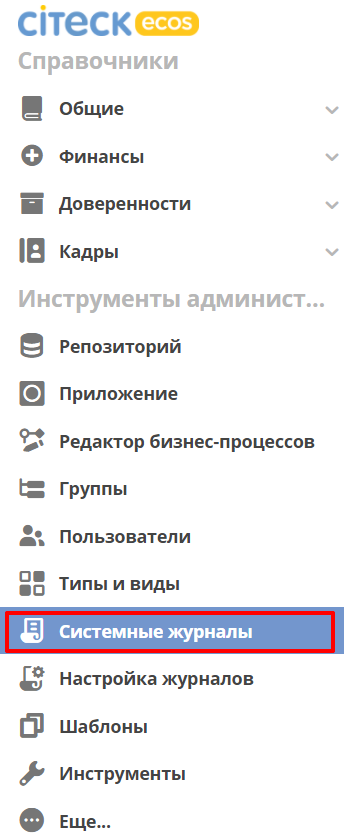

Справа сверху нажимаем на кнопку "Показать меню".

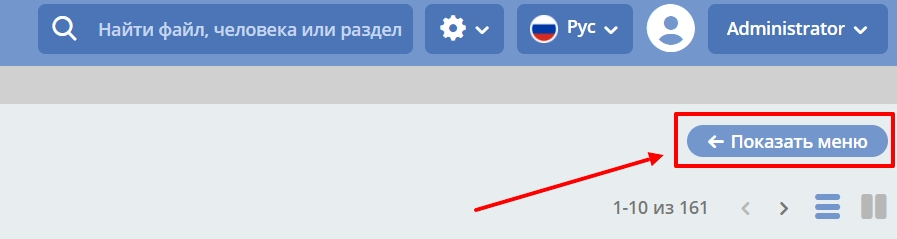

Выбираем "Типы кейсов".

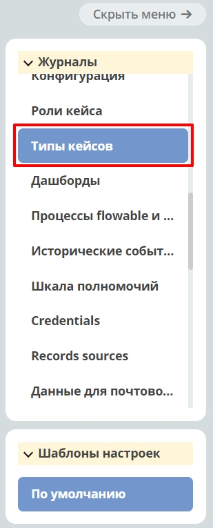

Слева сверху нажимаем на кнопку создания, выбираем "Создать новый тип".

.. image:: _static/Кнопка_создать_тип_кейса.jpg
        :scale: 100 %
        :align: center

Вкладка Main (id, parent, name, description)
--------------------------------------
Id - уникальный идентификатор.
Parent - выбрать base type.
Name - человекопонятное имя.
Description - описание данного типа кейса(необязательно).

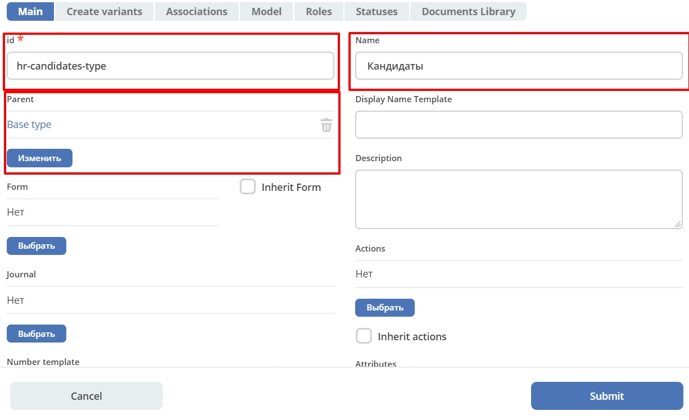

Вкладка Create variants (id, name, record ref)
~~~~~~~~~~~~~~~~~~~~~~~~~
Id - уникальный идентификатор.
Name - человекопонятное имя.
Record Ref - для справочника заполняется значением - dict@dl:dataListItem

.. image:: _static/Вариант_создания_для_справочника.jpg
        :scale: 100 %
        :align: center

Работа с моделью (Вкладка Model)
--------------------------------------
Заполняем модель атрибутами.
Id - уникальный идентификатор атрибута.
Name - человекопонятное имя атрибута.
Type- подходящий тип атрибута.

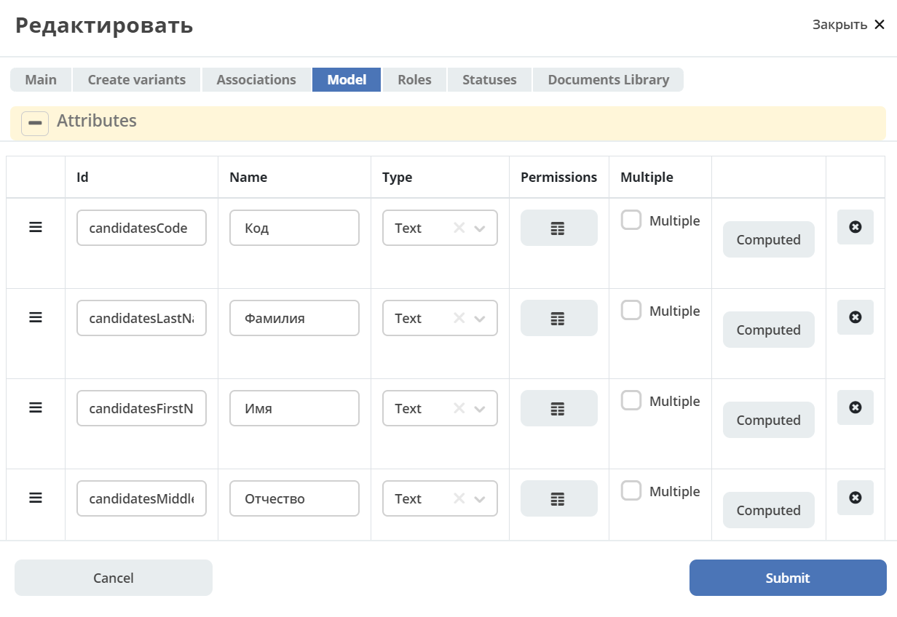

Создание формы "форма Кандидата"
-----------------------------------
Справа в меню переходим в системный журнал "Формы".

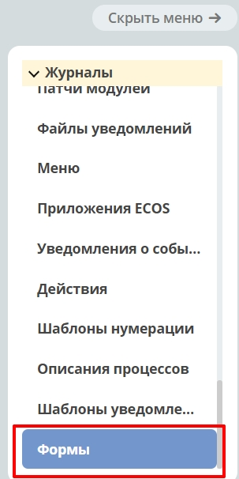

Нажимаем на кнопку создания формы.

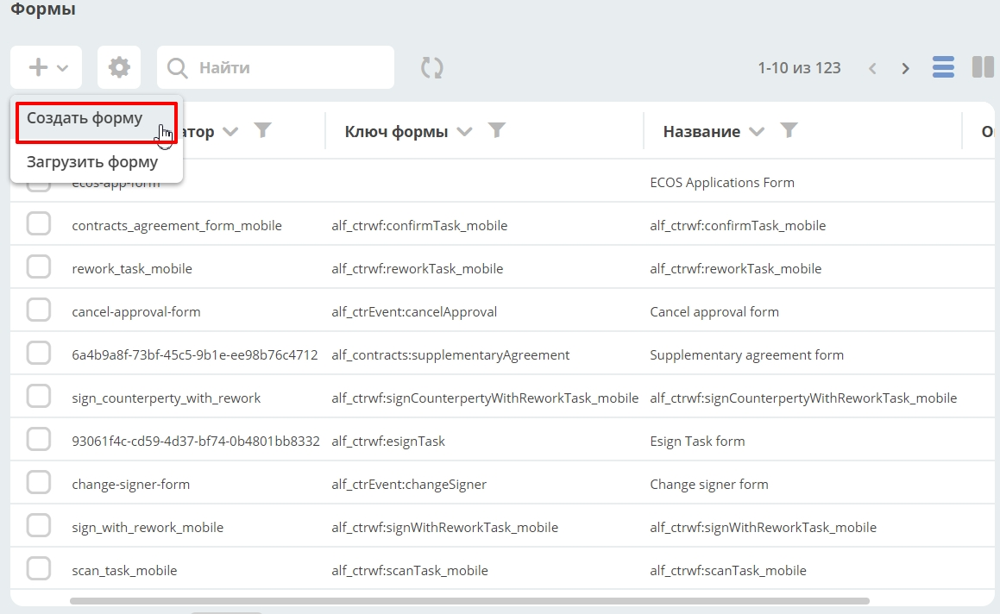

Основные параметры формы (Module id, Title, Key, Тип)
~~~~~~~~~~~~~~~~~~~~~~~~~~~~~~~~~~~~~~~~~~~~~~~~~
Module id - уникальный идентификатор формы.
Title - человекопонятное имя формы.
Key - ключ формы (такой же как и Module id).
Тип - из списка выбрать тип кейса, созданный ранее.

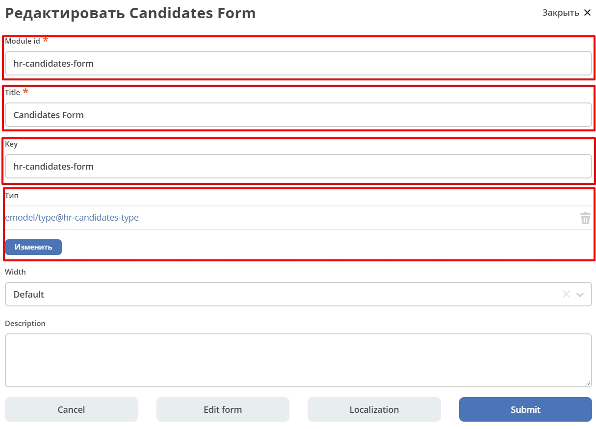

Form builder
~~~~~~~~~~~~
Здесь имеются различные компоненты формы.

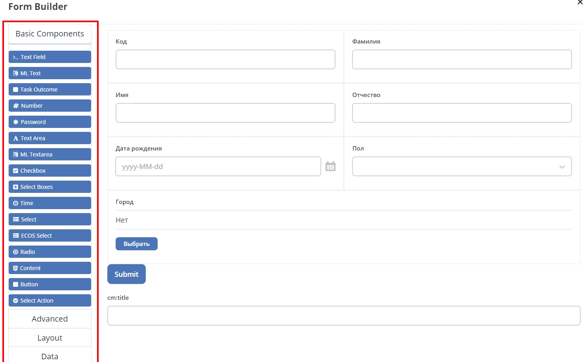

Columns - позволяет удобно расположить компоненты формы.

.. image:: _static/columns_component.jpg
        :scale: 100 %
        :align: center

Column Properties - основной параметр настройки, позволяет определить как по колонкам будет разбиваться компонент.

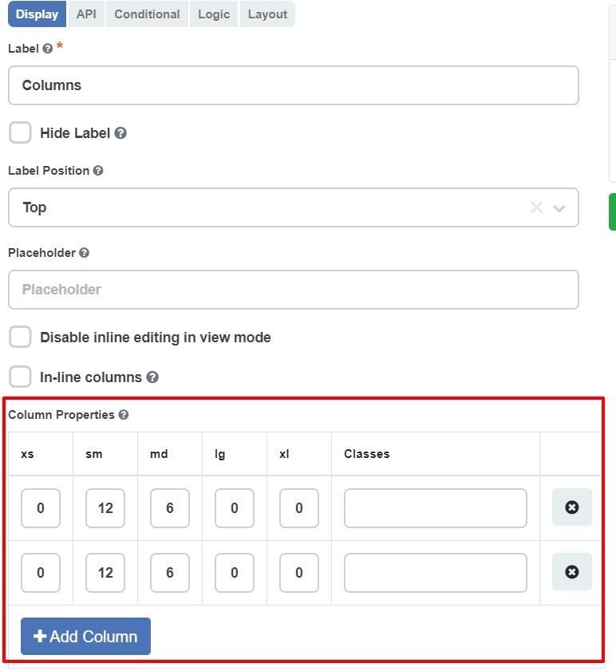

Text field (например "Код") - текстовый компонент.
Заполняется "Label" - человекопонятное имя компонента.

.. image:: _static/code_label.jpg
        :scale: 100 %
        :align: center

Вкладка API - здесь заполняется Property Name.
Property Name - имя свойства в типе кейса.

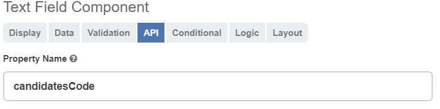

ECOS Select Component - компонент формы для выбора значения из списка.
Заполняется "Label" - человекопонятное имя компонента.

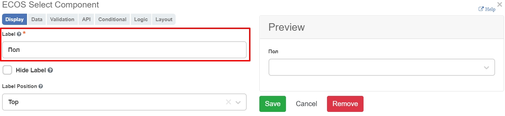

Вкладка "Data" - в "Data Source Type" выбираем "Values".
Data Source Values - заполняется значениями, которые должны быть в списке. (Label - отображаемое имя,
Value - значение, которое содержится)

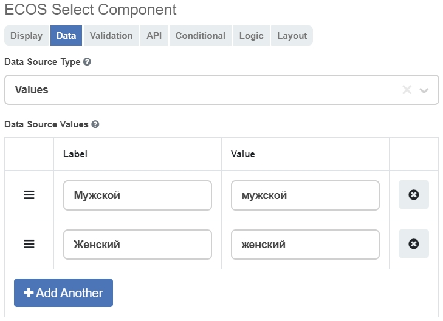

Вкладка API - здесь заполняется Property Name.
Property Name - имя свойства в типе кейса.

.. image:: _static/gender_api_candidates.jpg
        :scale: 100 %
        :align: center

Date / Time Component - компонент даты / времени.
Заполняется "Label" - человекопонятное имя компонента.
Format - позволяет указать формат даты.

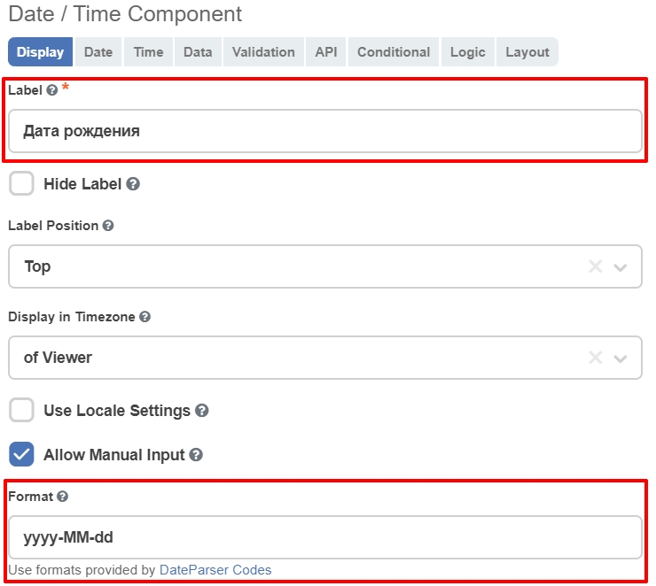

Вкладка API - здесь заполняется Property Name.
Property Name - имя свойства в типе кейса.

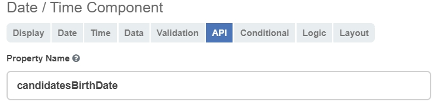

Select Journal Component - компонент для выбора значения из журнала.
Заполняется "Label" - человекопонятное имя компонента.

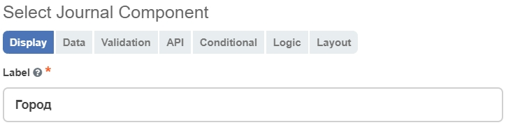

Вкладка Data - заполняется "Journal ID" - идентификатор журнала, который хотим использовать в компоненте.

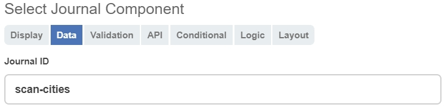

Вкладка API - здесь заполняется Property Name.
Property Name - имя свойства в типе кейса.

.. image:: _static/select_journal_api_candidates.jpg
        :scale: 100 %
        :align: center

Кнопка Localization
~~~~~~~~~~~~

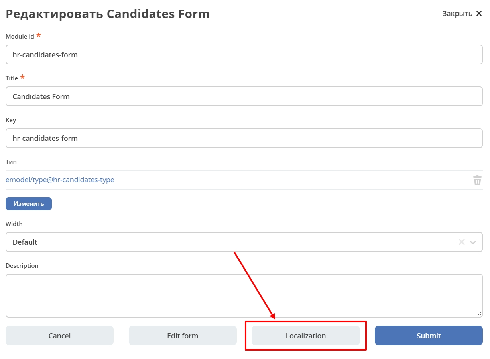

Здесь прописывается локализация для компонентов формы.
В параметре "Key" указывается Label компонента.
В Locale нажимаем кнопку Add Message, выбираем необходимый язык, в поле Message прописываем то,
что будет отображаться.

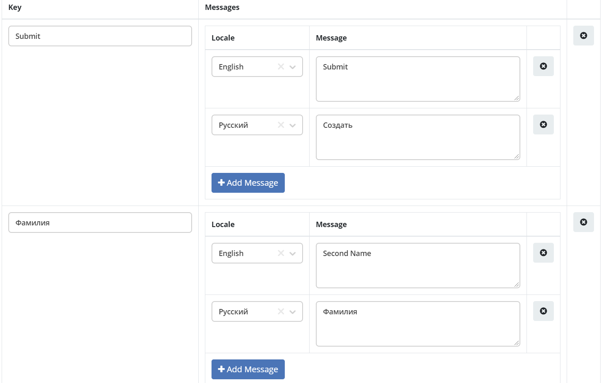

Создание журнала "журнал Кандидаты"
-----------------------------------
Справа в меню переходим в системный журнал "Журналы".

.. image:: _static/Переход_в_системный_журнал_журналы.jpg
        :scale: 100 %
        :align: center

Нажимаем на кнопку создания журнала.

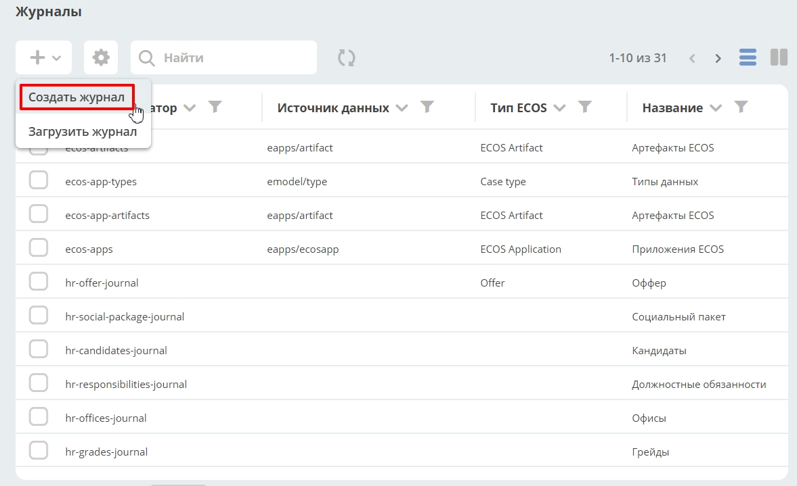

Основные параметры журнала (Идентификатор журнала, Наименование журнала, Тип кейса, Действия)
~~~~~~~~~~~~~~~~~~~~~~~~~~~~~~~~~~~~~~~~~~~~~~~~
Идентификатор журнала - уникальный идентификатор журнала.
Наименование журнала - человекопонятное имя журнала.
Тип кейса - из списка выбрать тип кейса, созданный ранее.
Действия - из списка выбрать действия, которые будут доступны для объектов журнала.

.. image:: _static/Параметры_журнала.jpg
        :scale: 100 %
        :align: center

Вкладка Columns (Обязательный для отображения)
~~~~~~~~~~~~~~~~~~~~~~~~~~~~~~~~~~~~~~~~~~~~~~
Здесь заполняются колонки журнала.
В "Наименование" пишем то, как будет называться колонка.
"Системное имя" - Id атрибута модели.

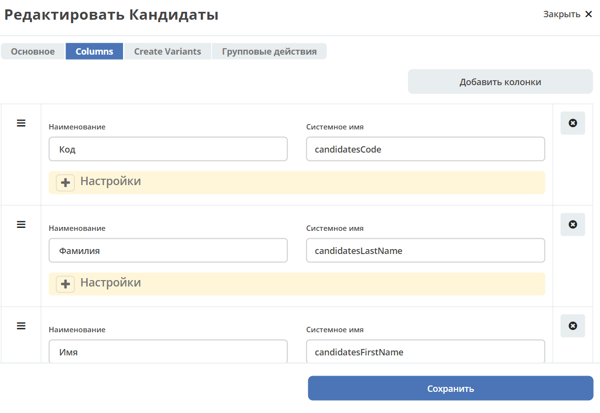

Вкладка Create Variants.
~~~~~~~~~~~~~~~~~~~~~~~~~~~~~~~~~~~~~~~~~~~~~~
Id - уникальный идентификатор.
Name - человекопонятное имя.
Record Ref - для справочника заполняется значением - dict@dl:dataListItem
Атрибуты - через ключ "_type" указываем в значении тип "emodel/type@hr-candidates-type"

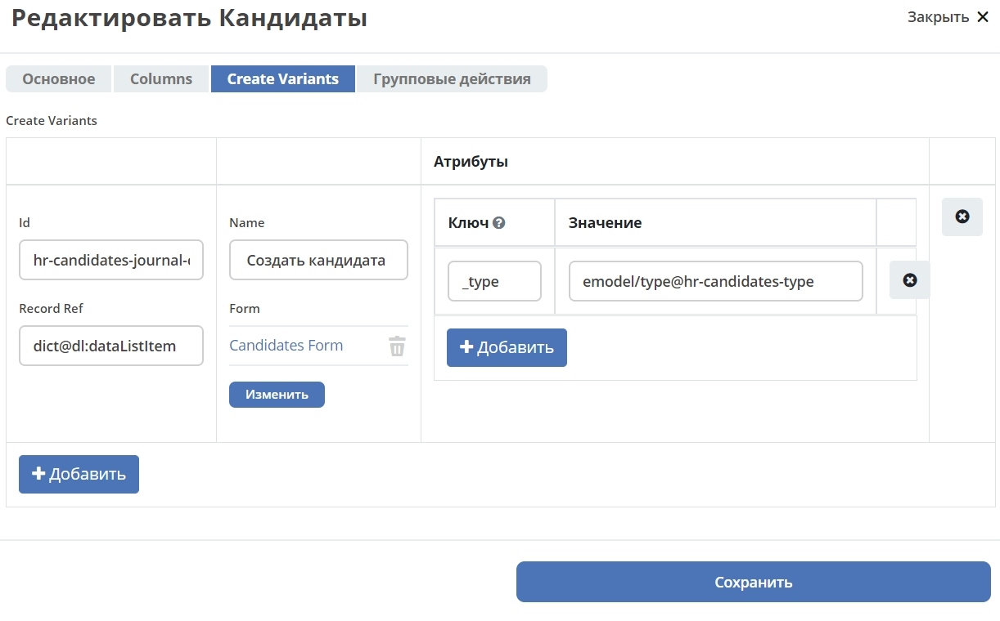

Добавление формы и журнала в тип кейса.
----------------------------------------
Справа в меню переходим в системный журнал "Типы кейсов".

Выбираем ранее созданный тип кейса "Кандидаты".

В параметре "Form" выбираем форму, которую создали.
В параметре "Journal" выбираем журнал, который создали.

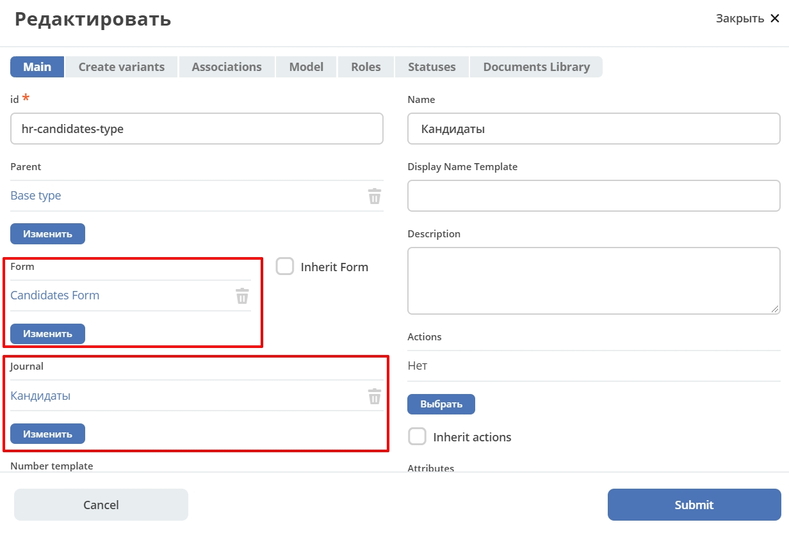

Настройка меню
--------------
Переходим в настройку меню, нажав на шестеренку, потом на кнопку "Настроить меню" справа сверху.

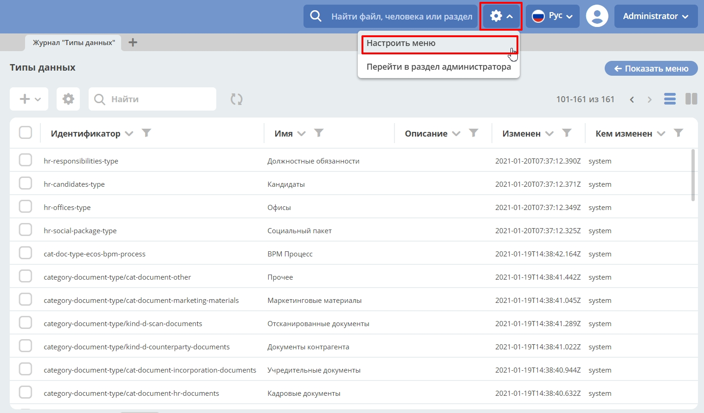

Выбираем элемент меню, в котором будет находится справочник "Кандидаты".
Наводим на элемент и нажимаем кнопку "Добавить", выбираем "Журнал", из списка выбираем необходимый журнал.

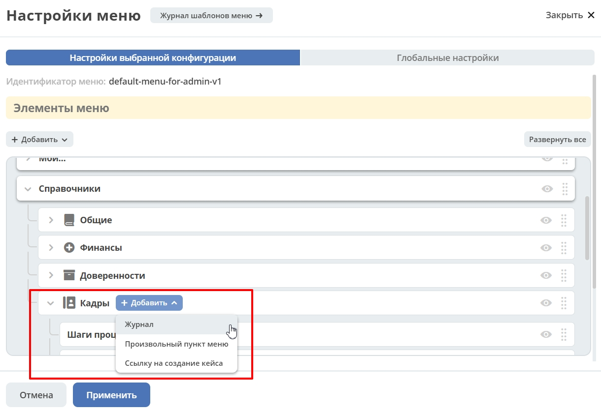

----------------------------------------------------------------------------------------------------------------------------------

=================================
Создание типа ECOS «Оффер»
=================================

Тип кейса
---------
Переходим в системные журналы.

Справа сверху нажимаем на кнопку "Показать меню".

Выбираем "Типы кейсов".

Слева сверху нажимаем на кнопку создания, выбираем "Создать новый тип".

.. image:: _static/Кнопка_создать_тип_кейса.jpg
        :scale: 100 %
        :align: center

Вкладка Main (id, parent, name, description, действия)
--------------------------------------
Id - уникальный идентификатор.
Parent - выбрать Case.
Name - человекопонятное имя.
Description - описание данного типа кейса(необязательно).
Действия (необязательно) - из списка выбрать действия, которые будут доступны на карточке кейса.

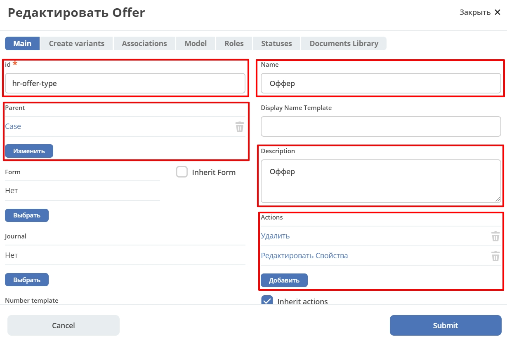

Вкладка Create variants
~~~~~~~~~~~~~~~~~~~~~~~~~
Id - уникальный идентификатор.
Name - человекопонятное имя.
Record Ref - заполняется значением - dict@idocs:doc

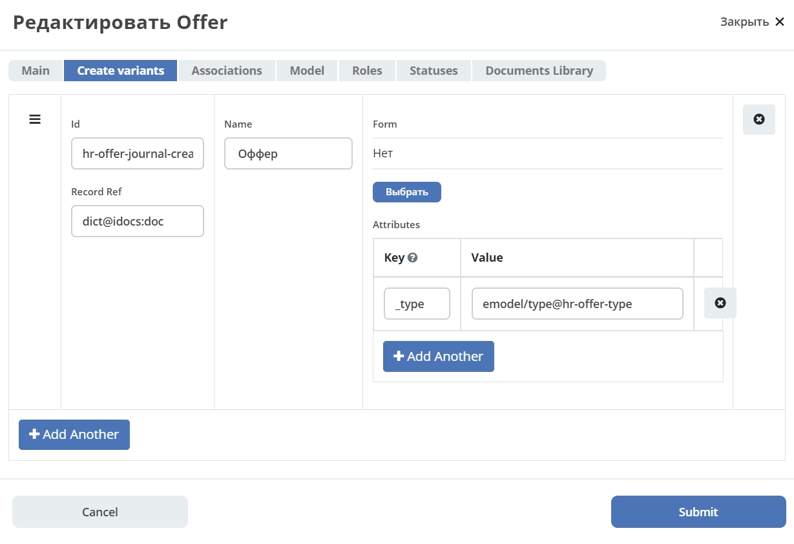

Работа с моделью (Вкладка Model)
~~~~~~~~~~~~~~~~~~~~~~~~~~~~~~~~~~~~
Заполняем модель атрибутами.
Id - уникальный идентификатор атрибута.
Name - человекопонятное имя атрибута.
Type- подходящий тип атрибута.

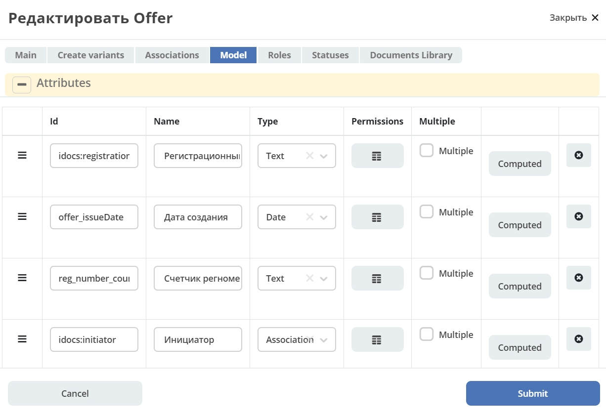

Роли (Вкладка Roles)
""""""""""""""""""""""""""""""""""""""""""""""""""""""""""""""""""""""""""""""""""""
Id - уникальный идентификатор роли.
Name - человекопонятное имя роли.
Assignees - можно выбрать группу пользователей и отдельных пользователей.
Атрибут - атрибут в модели.

.. image:: _static/Роли_оффера.jpg
        :scale: 100 %
        :align: center

Статусы (Вкладка Statuses)
""""""""""""""""""""""""""""
Id - уникальный идентификатор статуса.
Name - человекопонятное имя статуса.

.. image:: _static/Статусы_оффера.png
        :scale: 100 %
        :align: center

После того как настроили роли и статусы, во вкладке Model можно настроить матрицу прав.

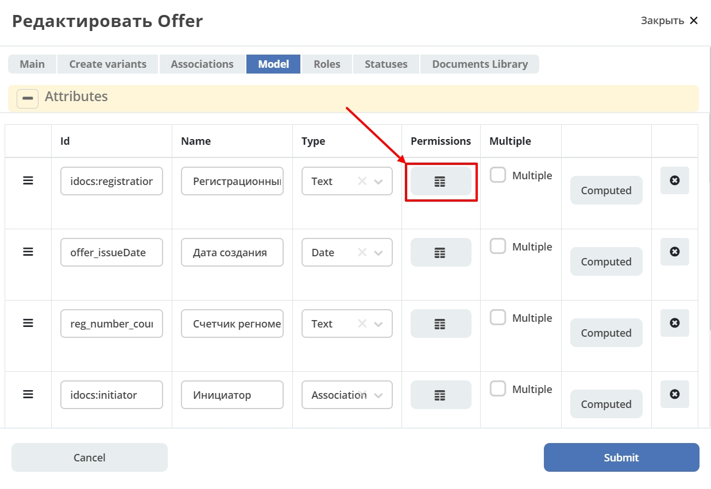

.. image:: _static/Кнопка_прав_оффер.jpg
        :scale: 100 %
        :align: center

Шаблоны нумерации
--------------
Выбираем "Шаблоны нумерации".

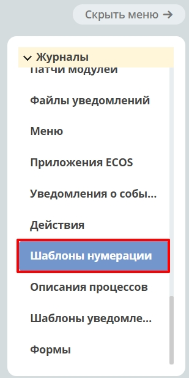

Слева сверху нажимаем на кнопку создания, выбираем "Создать новый шаблон".

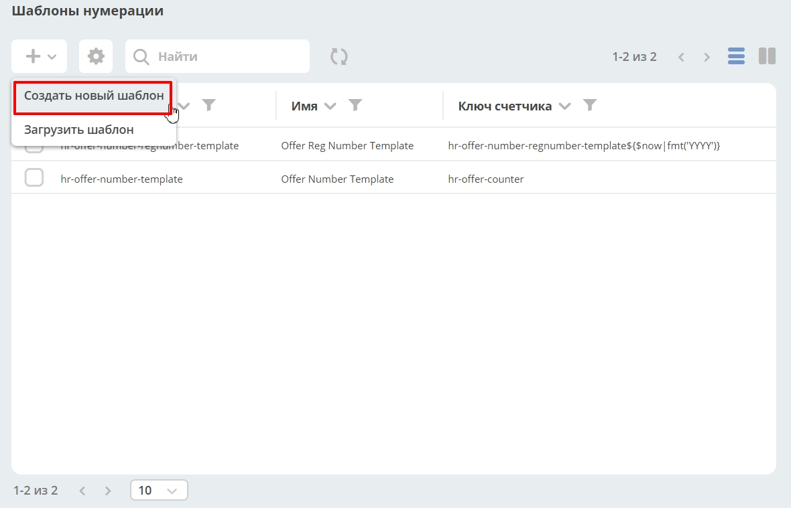

Id - уникальный идентификатор шаблона нумерации.
Name - человекопонятное имя шаблона нумерации.
Key - что написать?

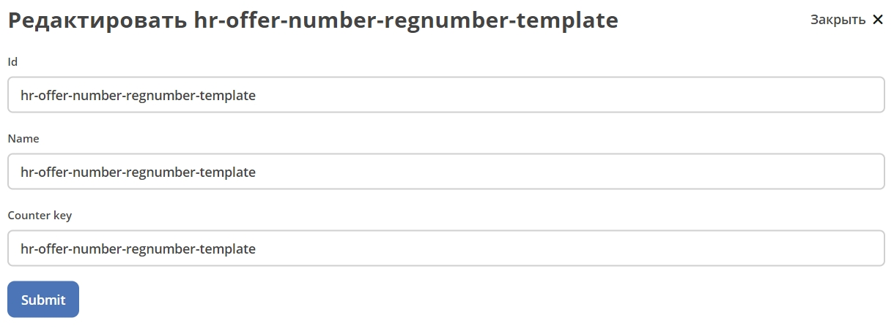

.. image:: _static/offer_number_template.jpg
        :scale: 100 %
        :align: center

После создания шаблонов нумерации добавим их в тип кейса.

Выбираем "Типы кейсов".

В параметре "Number template" выбираем шаблон нумерации.

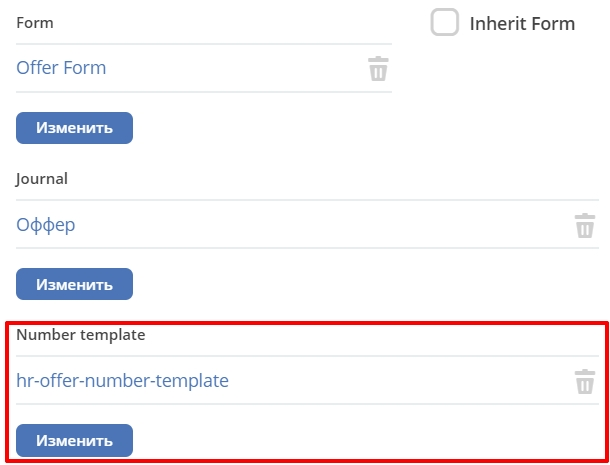

Во вкладке Model у атрибутов можно вычислить значение.

.. image:: _static/Кнопка_вычислить.jpg
        :scale: 100 %
        :align: center

Вычислим значение у атрибута "idocs:registrationNumber".

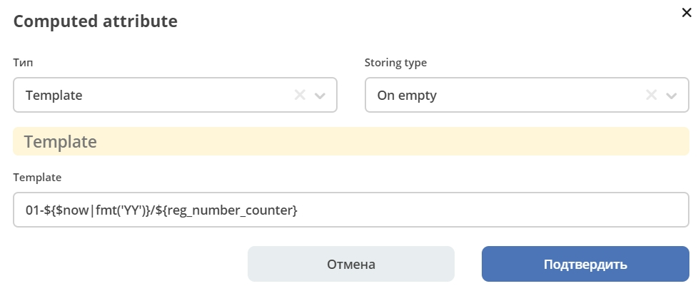

Выбрать нужный тип и заполнить соответствующие параметры (для каждого типа разные параметры).

Вычислим значение у атрибута "reg_number_counter".

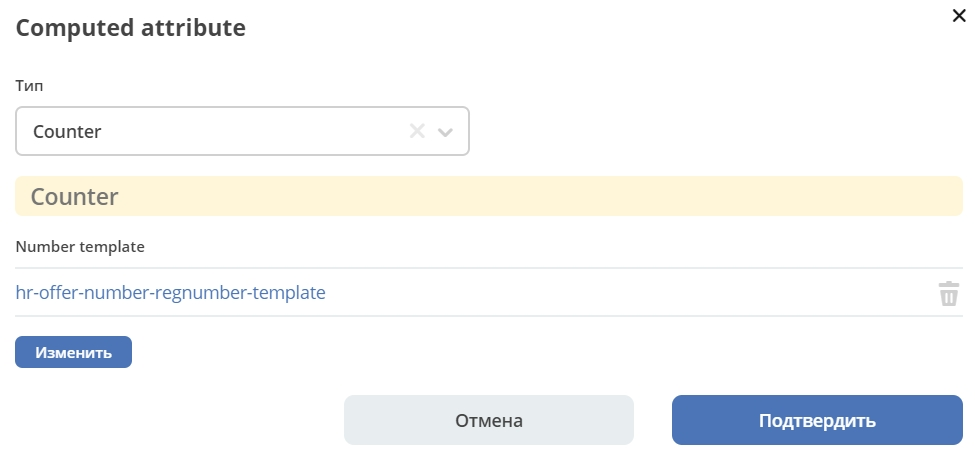

Создание формы "форма Оффер"
-----------------------------------
Справа в меню переходим в системный журнал "Формы".

Нажимаем на кнопку создания формы.

Основные параметры формы (Module id, Title, Key, Тип)
~~~~~~~~~~~~~~~~~~~~~~~~~~~~~~~~~~~~~~~~~~~~~~~~~
Module id - уникальный идентификатор формы.
Title - человекопонятное имя формы.
Key - ключ формы (такой же как и Module id).
Тип - из списка выбрать тип кейса, созданный ранее.

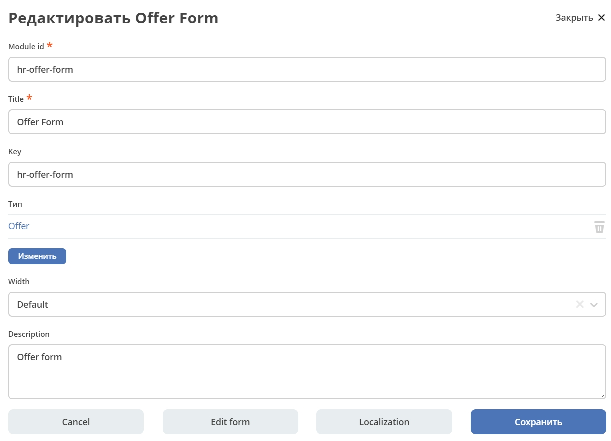

Form builder
~~~~~~~~~~~~
Здесь имеются различные компоненты формы.

.. _Создание формы "форма Кандидата":

`Создание формы "форма Кандидата"`_

Panel (например "Регистрация") - находится во вкладке "Layout"

.. image:: _static/component_panel.jpg
        :scale: 100 %
        :align: center

Заполняется "Title" - человекопонятное имя компонента.

.. image:: _static/panel_title.jpg
        :scale: 100 %
        :align: center

Select Orgstruct Component (например "idocs:initiator") - компонент для выбора из оргструктуры.
Заполняется "Label" - человекопонятное имя компонента.

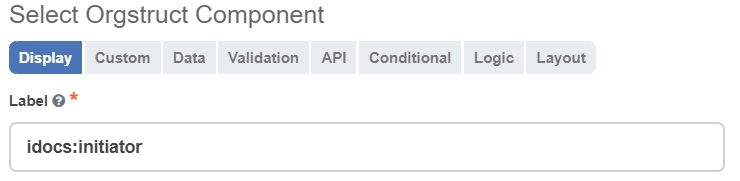

Вкладка Custom - можно указать допустимый тип "Allowed authority type",
Current user by default - настройка, позволяющая подставить в компонент пользователя, который открыл форму на создание.

.. image:: _static/orgstruct_custom.jpg
        :scale: 100 %
        :align: center

Вкладка API - здесь заполняется Property Name.
Property Name - имя свойства в типе кейса.

.. image:: _static/orgstruct_api.jpg
        :scale: 100 %
        :align: center

Async Data Component - асинхронный компонент.

.. image:: _static/asyncdata_component.jpg
        :scale: 100 %
        :align: center

Заполняется "Label" - человекопонятное имя компонента.
Data type - тип данных.

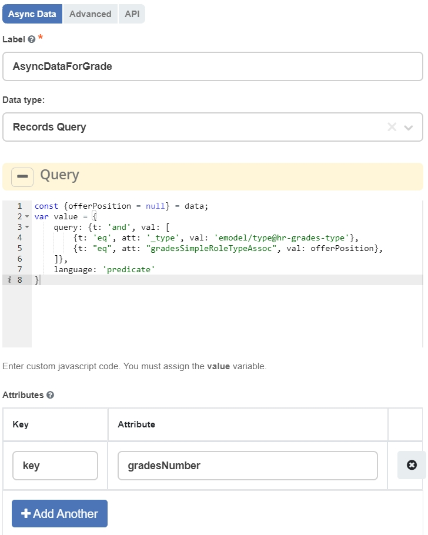

Пояснения к скрипту.

.. image:: _static/asyncdata_script.jpg
        :scale: 100 %
        :align: center

emodel/type@hr-grades-type - тип, из которого хотим получить какие либо данные.
gradesSimpleRoleTypeAssoc - сравниваемое свойство типа, из которого получаем данные.
offerPosition - свойство, которое используем для сравнения со свойством типа, из которого получаем данные.

Здесь указываем атрибут, который хотим получить.

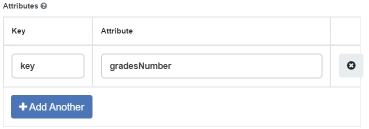

Вкладка Advanced.
Refresh on - данный параметр имеет поле для указания элементов формы, которые следует отслеживать.

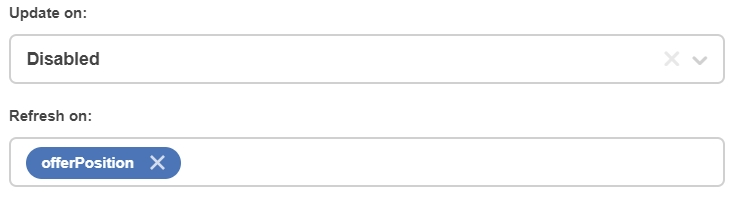

Вкладка API - здесь заполняется Property Name.
Property Name - человекопонятное имя свойства компонента.

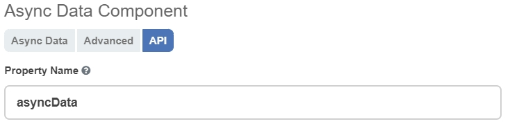

Чтобы компонент формы реагировал на асинхронный компонент, надо сделать следующие настройки:

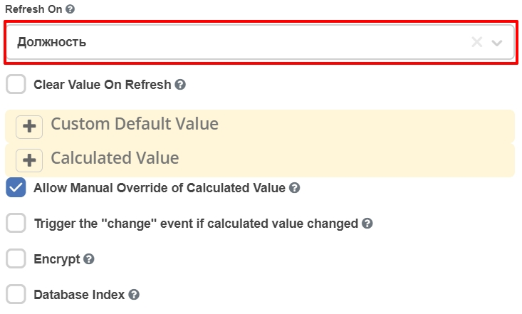

В Refresh On указать компонент, при изменении которого будет реагировать компонент, для которого хотим
получить данные из асинхронного компонента.

В Calculated Value:

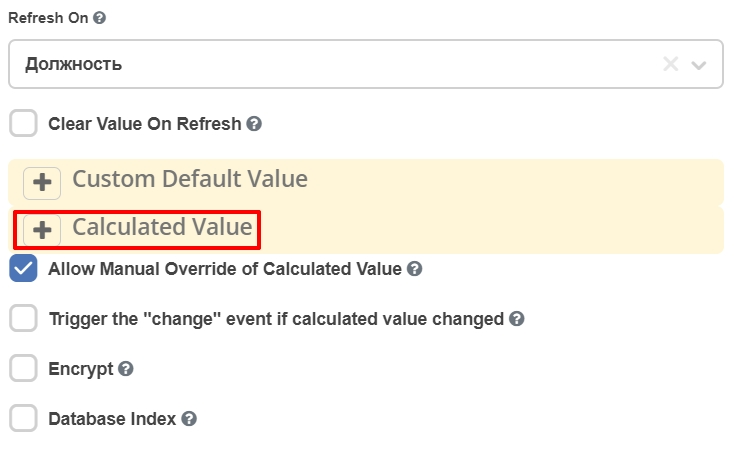

JavaScript:

.. image:: _static/grade_calculated_value_script.jpg
        :scale: 100 %
        :align: center

Теперь при выборе должности, в компонент формы "Грейд" в зависимости от значения компонента "Должность",
будет автоматически выставлено значение.

Также в компонентах формы при необходимости можно выставить следующие настройки:
Disabled (вкладка Display) - делает компонент нередактируемым.

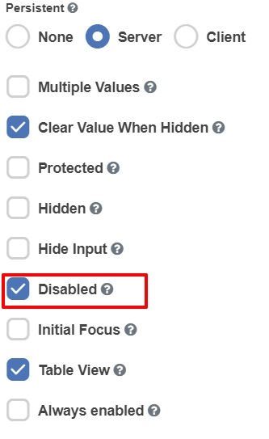

Required (вкладка Validation) - делает компонент обязательным для заполнения.

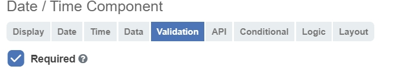

Кнопка Localization
~~~~~~~~~~~~

.. _Создание формы "форма Кандидата":

`Создание формы "форма Кандидата"`_

Создание журнала "журнал Оффер"
-----------------------------------
Справа в меню переходим в системный журнал "Журналы".

.. image:: _static/Переход_в_системный_журнал_журналы.jpg
        :scale: 100 %
        :align: center

Нажимаем на кнопку создания журнала.

Основные параметры журнала (Идентификатор журнала, Наименование журнала, Тип кейса, Действия)
~~~~~~~~~~~~~~~~~~~~~~~~~~~~~~~~~~~~~~~~~~~~~~~~
Идентификатор журнала - уникальный идентификатор журнала.
Наименование журнала - человекопонятное имя журнала.
Тип кейса - из списка выбрать тип кейса, созданный ранее.
Действия - из списка выбрать действия, которые будут доступны для объектов журнала.

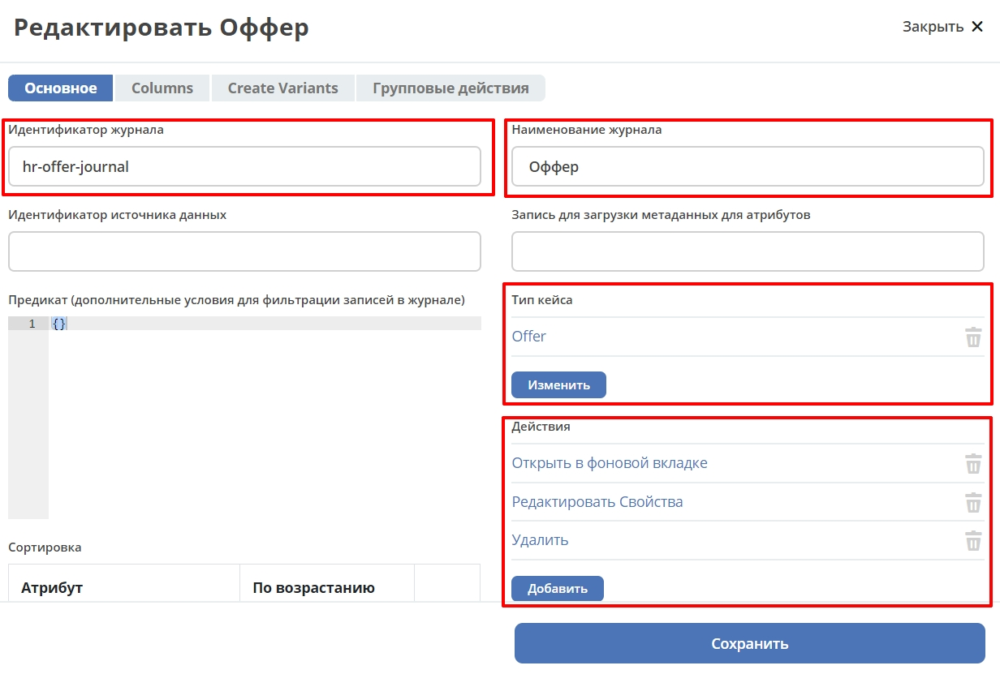

Вкладка Columns (Обязательный для отображения)
~~~~~~~~~~~~~~~~~~~~~~~~~~~~~~~~~~~~~~~~~~~~~~
Здесь заполняются колонки журнала.
В "Наименование" пишем то, как будет называться колонка.
"Системное имя" - Id атрибута модели.

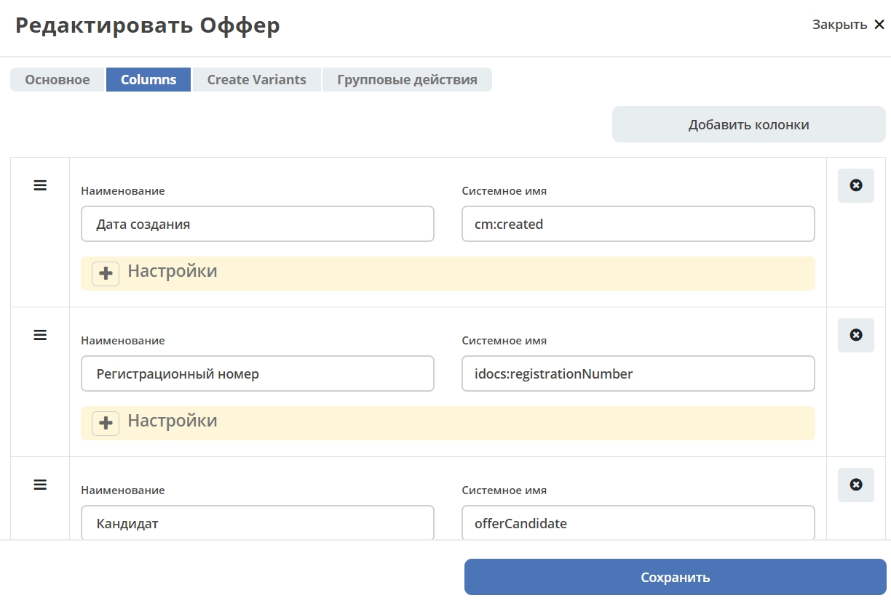

Вкладка Create Variants.
~~~~~~~~~~~~~~~~~~~~~~~~~~~~~~~~~~~~~~~~~~~~~~
Id - уникальный идентификатор.
Name - человекопонятное имя.
Record Ref - заполняется значением - dict@ecos:case
Атрибуты - через ключ "_type" указываем в значении тип "emodel/type@hr-offer-type"

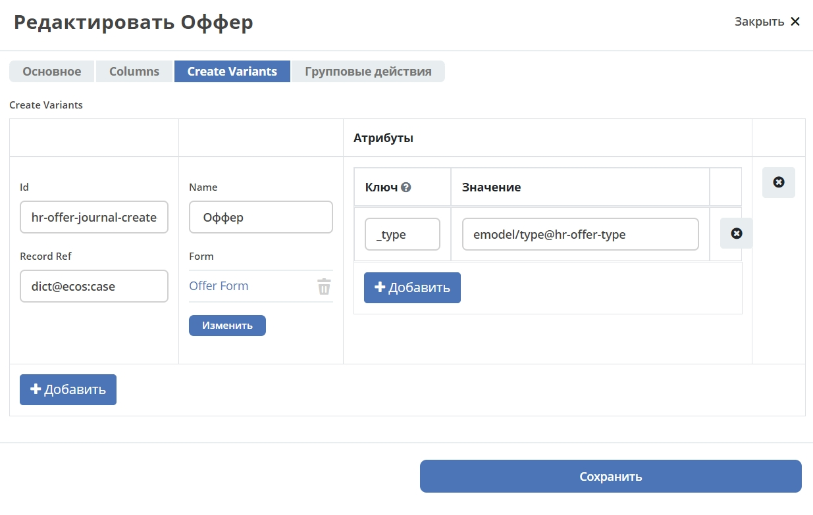

Добавление формы и журнала в тип кейса.
----------------------------------------
Справа в меню переходим в системный журнал "Типы кейсов".

Выбираем ранее созданный тип кейса "Офер".

В параметре "Form" выбираем форму, которую создали.
В параметре "Journal" выбираем журнал, который создали.

Настройка меню
--------------
Переходим в настройку меню, нажав на шестеренку, потом на кнопку "Настроить меню" справа сверху.

Выбираем элемент меню, в котором будет находится "Офер".
Наводим на элемент и нажимаем кнопку "Добавить", выбираем "Журнал", из списка выбираем необходимый журнал.

